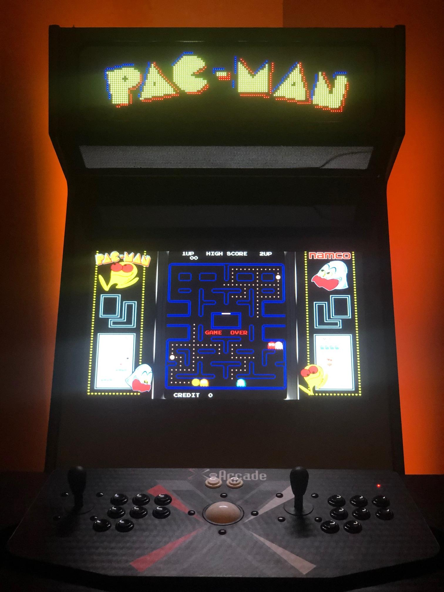

I sold a bunch of my old Sonos equipment and decided to splurge on the arcade. I had been looking
at [GameOnGrafix](https://www.gameongrafix.com/) for artwork for the side panels and the marquee for the arcade cabinet.
I was undecided what I wanted to do as Kelly has a vinyl cutter, so it might be possible to make my own side panel art,
but I was going to need a marquee.

And then I found the [Pixelcade](https://pixelcade.org/), which is an LED marquee. Available in five different sizes, I
went with the P4, a 20" x 5" marquee made of 2 LED panels. It should work out of the box with LEDBlinky (on Windows) and
RetroPie on the Raspberry Pi.  (I'm still undecided what OS I'm going to run if I don't use the Raspberry Pi 3 B+.)

Depending on the game you're playing, the marquee will display the game art / title for that game. From their website,
here's a cabinet when playing Pac-Man:

Here's just a small sample of the game art Pixelcade supports from their homepage:

Check out their homepage for videos of it in action and more artwork.

It's going to add some complexity to mount this in the cabinet as I have zero woodworking skills, but they have some
nice mounting guides that should hopefully get me started.

The Pixelcade consists of the two LED panels, a power supply, and a logic board with a micro-SD card. It looks like
there is really [good documentation](https://pixelcade.org/howto/) for installation of the hardware and software,
including videos. And if I get really ambitious, there's even a [REST API](https://pixelcade.org/api/) for more
customization.

I still have a ton of work before I even get to the point of installing this, but if and when this cabinet is done, the
Pixelcade is going to be a killer feature.
