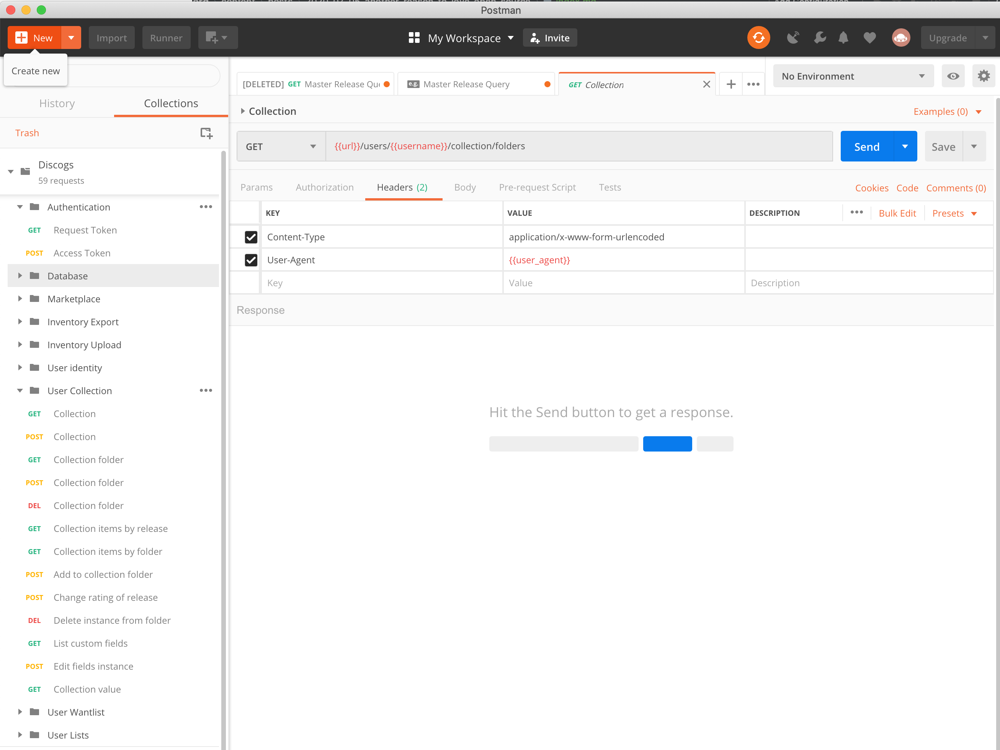

I've been using free and open source software (FOSS) for over twenty years and I've involved in with different FOSS projects for ten to fifteen years (on and off).  Thare are so many different aspects of the open source community that I love (community being a big one to start with) and here's another example.

I'm trying to build a new website using Python and the [Pyramid](https://www.trypyramid.com) framework.  I want to interact with APIs on the Discogs website.  [Discogs](https://www.discogs.com) is a website and community that allows you to catalog your music and also buy and sell music.  For me, this is all about my record collection.  I'll be posting more about what I want to do, but right now I'm just trying to learn what my options are with the [Discogs API and how to connect and interact with their API](https://www.discogs.com/developers/#).  I'm struggling a little bit to get authentication working.

I'm also using [Postman](https://www.postman.com/), an application that makes it easy to test different APIs and see how they return data.  I first learned about Postman through the [Talk Python trainings](https://training.talkpython.fm) (another reason to love the Talk Python trainings) and it was a core tool in building NFLPool and MLBPool to understand how MySportsFeeds showed sports data to integrate into those two apps.

If I'm struggling to authenticate and login to the Discogs API, I'm never going to get any results.

And here is why I love open source:   Github user [leopuleo](https://github.com/leopuleo) has a [`Discogs-Postman`](https://github.com/leopuleo/Discogs-Postman) repository where he has taken the time to not only put together almost 60 different ways to use the Discogs API, it also includes documentation and tests!

This is all licensed under the MIT License, giving you the ability to take it and modify as you need to.  *leopuleo* didn't have to do this, nor did he have to share it, or give it a license that just gives it away and let's you do anything you want with it.  This is just one reason why open source is awesome - someone builds something, shares it with the world, and even better, let's you build on top of it.

Open source and free software rocks.

