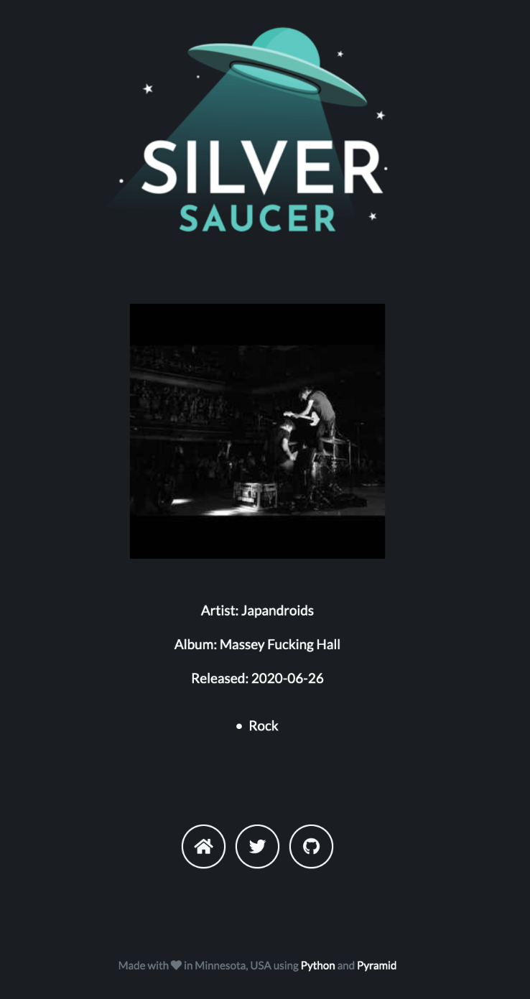
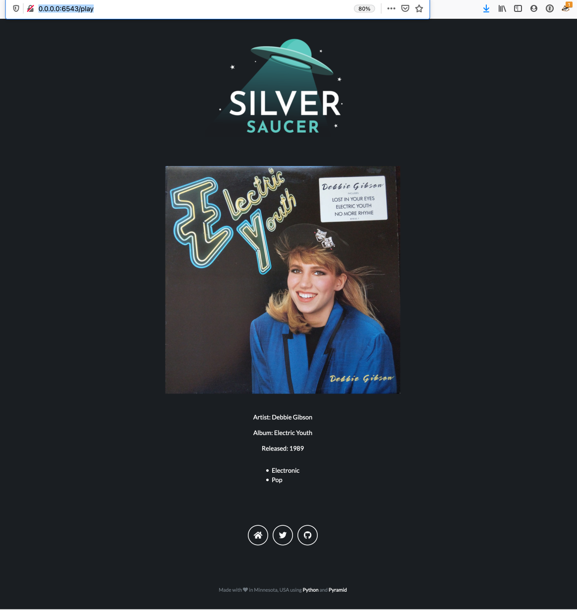

In my [last blog post](https://paulcutler.org/posts/2020/12/iterating-through-the-folder-dictionary/), I was able to 
pass the folder to Discogs to get a list of albums, and then pick one at random and give me information back about 
the album picked.  That information was returned as a dictionary and now it is time to wire it up to the Chameleon 
template in Pyramid that will display the HTML.

Here's an example of the JSON:

```
{'release_title': 'Massey Fucking Hall', 'release_uri': 'https://www.discogs.com/Japandroids-Massey-Fucking-Hall/release/16118824', 'artist_name': 'Japandroids', 'artist_url': 'https://api.discogs.com/artists/1473872', 'release_date': '2020-06-26', 'discogs_main_id': 1829048, 'discogs_main_url': 'https://api.discogs.com/masters/1829048', 'main_release_date': 2020, 'release_image_uri': 'https://img.discogs.com/BVmRNi_A5_Vm8X0ntzUDh8figvE=/fit-in/300x300/filters:strip_icc():format(jpeg):mode_rgb():quality(90)/discogs-images/R-16118824-1604177632-7503.jpeg.jpg', 'genres': ['Rock']}
```
In the controller that handles the routing for the page I have:

```@view_config(route_name="play", renderer="silversaucer:templates/play/play.pt")
def play(_):

    album_release_id = RandomRecordService.get_folder_count(2162484)
    print(album_release_id)
    release_data = RandomRecordService.get_album_data(album_release_id)
    print(release_data)

    return {"release_info": release_data}
```

It was way easier than expected.  (And if you know me, you know that the random record picked above is perfect, as 
I'm a huge Japandroids fan.)  The first thing I did was connect the image URI that the Discogs API passes in the 
Chameleon template:

```

```

That worked, which was awesome.  The whole image is shown, and I don't have to worry about parsing any of the URL.

I quickly added the values to show the *Artist*, *Album*, and *Release Date* information:

```
<p>Artist: ${release_info.artist_name}</p>
<p>Album: ${release_info.release_title}</p>
<p>Released: ${release_info.release_date}</p>\
```

It looks like this:



Looking at Debbie Gibson's *Electric Youth*, the *Genre* key in the dictionary returns a list:

```
'genres': ['Electronic', 'Pop']
```

With some trial and error I was able to display the list, but it showed up as code, looking like:
`['Electronic', 'Pop']`.  No one wants to see that.  The challenge is that Chameleon templates use something like a 
shorthand for Python code.  I revisited two of my former projects where I would iterate over a list and show the 
results, but after lots of trial and error I felt like I was going backwards.  After lots of search engine queries and 
Stack Overflow searching I did what I always do when I get stuck:  I ask my wife.  It took her about 15 minutes to 
figure out how to loop over the list and show it in bullets:

```
<p><li tal:repeat="item release_info.genres" tal:content=item/>
```

I was so close - she pointed out the mistake I made with having two `tal:repeat` methods in the template. That’s what’s
hard about the trial and error method of finding the solution, especially as I wasn’t writing down the methods
that kind of worked.  (Oops. Usually I have a note going in Bear to capture things like this, but sometimes you get in
the zone and just keep trying things as you get closer. Documentation is good!)

Lastly, I changed the image size of the album image returned from Discogs, shrinking it from 400x400 to 300x300 and 
it seems to fit in the Bootstrap container better.  You can see the difference with Debbie Gibson's *Electric Youth* 
below at 400x400 and Japandroids at 300x300 above.



Now I have lots of cleanup to do.  I need to turn the text into links, for example if you click on the artist, 
Japandroids, it takes you to their page on Discogs.  I also need to fix how it justifies and draws the bullets.  I think almost 
all of this is done in CSS and I don't know CSS at all...  (I had to cheat to make the text color white to show up 
on the page already.)

Random thoughts and musings:
* Every time the page loads, it refreshes the API call.  So if you click a link to the artist page on Discogs, for 
  example, and then click the back button, that album data has been replaced.  Not sure how to work around that, 
  though I have some ideas.  Probably a good question in IRC with the Pyramid team.
* I like Chameleon templates.  Not only is it the first template language I've learned, I've looked at Jinja 
  templates and they look harder to use.  They're used much more widely and that seems to lead to better documentation, but I 
  don't have plans to change from Chameleon.
* I had more thoughts, but I'm finishing up this blog post almost a week later as my internet went out.
* The *Release Date* returned from Discogs has the same problem I've already talked about for the future "On This 
  Day" feature I want to add.  It could be just the year or the full release date, you never know what you're going 
  to get.  Look at the two screenshots above! I don't know if I want to add all the functionality to return the 
  "correct" release date yet.  I'm worried about how long the API calls take to load the page.  (Even if it's just for me and I know how long it 
  takes, I don't want it taking long.)
