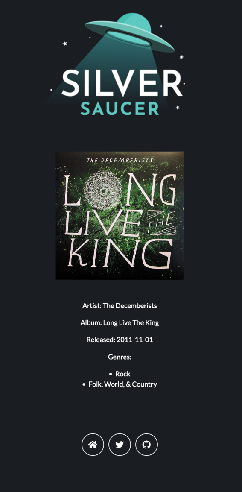

---
title: Play Singles Part 2
author: Paul Cutler 
type: post 
date: 2021-01-02T17:00:00 
comments: true
categories:
  - Python
tags:
  - Silver Saucer
  - Python
  - Pyramid
  - Discogs
  - API

--- 
I was talking to my wife yesterday about my progress and she agreed that I should update my
existing method used for albums to also work for singles - and that I shouldn’t just re-use that method and to avoid
code duplication. It’s good to get confirmation that I’m on the right path.

But I’m stuck on how to do this.

If we look at the route to play a full album:

```
@view_config(route_name="play", renderer="silversaucer:templates/play/play.pt")
def play(_):

    album_release_id = RandomRecordService.get_folder_count(2162484)
    release_data = RandomRecordService.get_album_data(album_release_id)
    return {"release_info": release_data}

```

Here I’m manually passing the folder ID for my Discogs Folder that contains full albums (2162484). That ID is passed to
a method that gets a count of how many items are in that folder to pick one at random. Once that happens, it passes the
release ID of the pick to get the album’s information.

Works great for full albums. As mentioned in my last blog post, it bombs if it’s a single, because there’s no concept of
a main (or “master”) release associated with EPs and singles.

So how do I refactor my code to account for this?

I started by updating the route to play a full album, adding a `folder` parameter to the `get_folder_count` method
instead of passing the folder number manually:

```
@view_config(route_name="play", renderer="silversaucer:templates/play/play.pt")
def play(_):

    folder = 2162484
    album_release_id = RandomRecordService.get_folder_count(folder)
    release_data = RandomRecordService.get_album_data(folder, album_release_id)
    return {"release_info": release_data}
```

And I tell that method to now return both the release ID and the folder:

```
def get_folder_count(folder):

    discogs_api = folder_url + "?=" + api_token

    # TODO Add an if statement to check for a 200 or 404 response code and redirect on 404 to error page

    response = requests.get(discogs_api)

    record_json = response.json()
	  return random_album_release_id, folder

```

Keeping with my goal of only using one method and passing the folder to it, I added an `if` statement to check if it’s
the folder with full albums. If it is, get the data I know is working. If not, don’t get the data that’s not included in
an EP or single.

```
@staticmethod
def get_album_data(folder, album_release_id):

    if folder == 2162484:

        release_api = (
            config.discogs_url
            + "releases/"
            + str(album_release_id)
            + "?"
            + config.discogs_user_token
        )
        print(release_api)
        response = requests.get(release_api)
        print(response)

```

But now my method to get the release information on an album broke, when it was working before:

```
  File "/Users/prcutler/workspace/silversaucer/silversaucer/controllers/music_controller.py", line 14, in play
    release_data = RandomRecordService.get_album_data(folder, album_release_id)
  File "/Users/prcutler/workspace/silversaucer/silversaucer/services/play_service.py", line 114, in get_album_data
    release_uri = release_json["uri"]
KeyError: 'uri'
```

Digging into it with another print statement, I see that the value for `album_release_id` is now returning the folder ID
correctly, but `album_release_id is returning a tuple:

```Folder ID =  2162486 Album =  (3200538, 2162486) <class 'tuple'>
```

Which is why the API call below is screwed up:

``` 
 File "/Users/prcutler/workspace/silversaucer/silversaucer/services/play_service.py", line 114, in get_album_data
    release_uri = release_json["uri"]
KeyError: 'uri'
https://api.discogs.com/releases/(1366279, 2198941)?&token=
```

But it’s a tuple!  I can work with that. The `folder` number is always returned as the second part of the tuple and
the `album_release_id` is always the first index. So let’s update the `release_api` first to use the first index:

```
release_api = (
    config.discogs_url
    + "releases/"
    + str(album_release_id[0])
    + "?"
    + config.discogs_user_token
)
```

And now everything works!  I updated the `else` statement to go get the data I need and not include the values that were
returning a `KeyError` and now with one method - that includes an `if / else` statement, I can get back the release
information for any record in my collection, no matter what folder it’s in. If and when I add other media - especially
CDs or tapes that have a main release, I’ll need to update the `if` statement, but future me can deal with that. I don’t
even have that stuff cataloged yet.  (But I made sure to add a `TODO` to my code so I don’t forget.

And here’s a screenshot of a random 10” EP that was returned. Yay!

