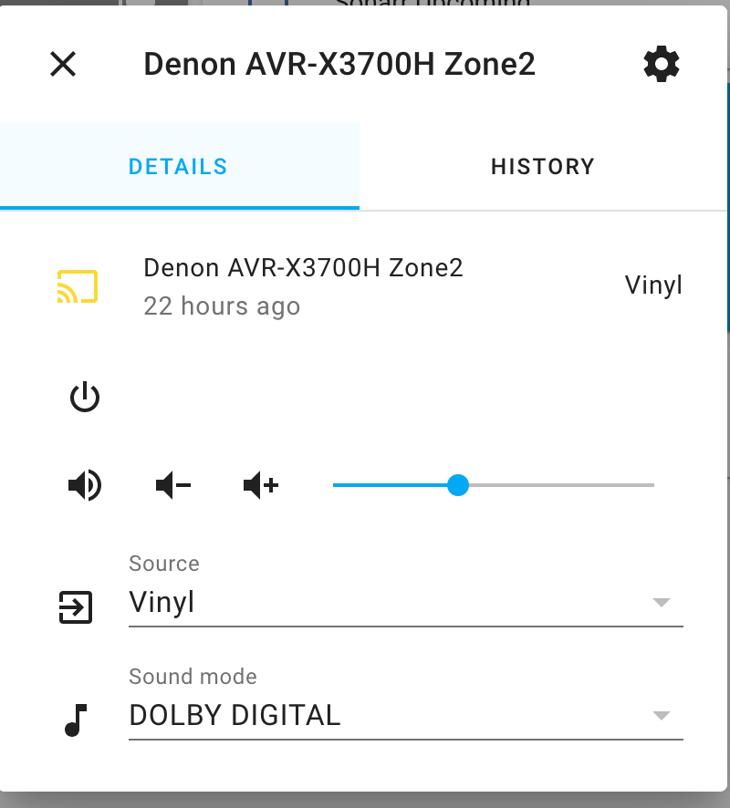
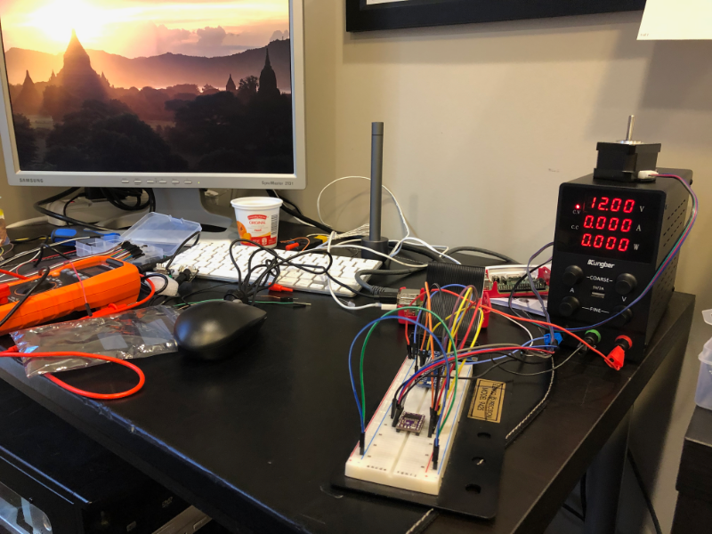

I haven’t blogged about my progress on Silver Saucer over the last month, but that doesn't mean I haven't been up to 
anything. I’ve continued to take the HTML, CSS, and Javascript on Coursera. I find CSS... difficult. Unfortunately, I 
also received an email from the course instructor that Coursera will be removing this course soon, so that figures. 
But it's motivation to get it done.

One of the things I tackled a few weeks ago was making an applet to sit in the macOS menu bar to control the volume of
my Denon receiver located in my home theater. The receiver’s Zone 2 controls the volume in my office, where I’m usually
listening to records. It took 30 minutes to throw some code together using [RUMPS](https://github.com/jaredks/rumps)
 to make the applet and the [denonavr](https://github.com/scarface-4711/denonavr) Python module to control the receiver.

That led me down a path of looking into making a hardware project to make a dial to control the volume. Adafruit has
a [great tutorial on building one](https://learn.adafruit.com/media-dial/overview), but I don’t have a 3D printer (yet).

That led me into looking more into the `denonavr` Python module - which is also the same module that
powers [Home Assistant](https://www.home-assistant.io/). I’ve now reinstalled Home Assistant - it’s been a couple of
years since I last tried it out. Now I can just turn to a browser page I leave pinned and control my receiver from
there. I’ve spent a few days playing and tweaking Home Assistant to see most of my “smart” devices, but I’ve never been
all that into having a smart home (nor will you find any voice assistants here). Of course this has given me a dozen
ideas of things to build or integrate. But I think I still want to build a dial!

I also spent a few days doing a deep dive into Docker. I have a couple containers that I run on my NAS, but never really
understood the right way to update or manage them. Now that I have a little more knowledge I realize how slick
containers really are.

Finally, I was on vacation last week and started to tackle another project I’ve talked about with a friend for the last
couple years. We need a pump (or pumps) programmed for a project. I had some old Raspberry Pi computers laying around
and a year ago we quickly prototyped a solution. Unfortunately, we needed a more powerful pump - both in how it pumps
and in power consumption.

I’ve been learning about circuits and electricity by watching a lot of YouTube videos and reading a number of books I’ve
picked up over the years (especially on Humble Bundle) . I then went out and bought bench power supply unit (PSU) and
multimeter for my workbench. I figured out how to power the breadboard with a 3.3v / 5v breadboard power supply first
and then figured out how to use the PSU, too. It was kind of exciting to see a little blue LED light up the first time I
got a circuit right:

<blockquote class=“twitter-tweet”>
Well, that’s exciting. Sometimes it’s the little things. <a href=“https://t.co/QM89RgzhjU”>pic.twitter.com/QM89RgzhjU</a>
&mdash; Paul Cutler (@prcutler) <a href=“https://twitter.com/prcutler/status/1360236673628397576?ref_src=twsrc%5Etfw”>February 12, 2021</a></blockquote>  

Here’s a picture of my messy workbench below with the Pi hooked up to a breakout board which connects to the breadboard.
Also connected to the breadboard is a DRV8825 motor controller which is connected to a NEMA step-motor.

In theory, I have everything hooked up correctly now to start prototyping. Now the hard part starts:  Is the code wrong
or the hardware hooked up incorrectly?!

