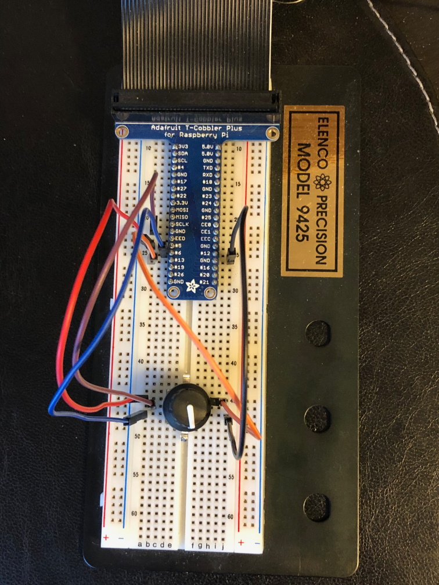

Previously: [Part 1](https://paulcutler.org/posts/2021/07/introducing-pi-dial-part-one/), [Part 2](https://paulcutler.org/posts/2021/07/introducing-pi-dial-part-two-oops/)

At the end of my second blog post, I had decided to switch from using the CircuitPython Media Dial to using a Raspberry Pi instead.  The media dial is much smaller (and cuter!) than a full blown Raspberry Pi, but I need to start somewhere and writing one Python application for the Pi seems easier (for the moment) than two different programs.

It was time to start prototyping and write some code!  There are a ton of guides on the internet for programming a Raspberry Pi with a rotary encoder.  Unfortunately, a lot of them are older from when the Pi first came out almost ten years ago.  The Python programs I found were either legacy Python 2 code or used old Raspberry Pi libraries in Python when I wanted to use the `gpiozero` library.

I hooked up T-Cobbler breakout board and cable from the Pi to the breadboard.  This makes it simple to swap jumper cables to make sure it’s wired correctly.  

I couldn’t quite get it at first.  I ran one of the Python 2 programs I found and it was working.  So I knew I had wired it up correctly and it was time to read the `gpiozero` docs some more.

Within three or four hours I had it all working.  I wish I had kept better notes for these blog posts to share some of the broken code versus where I ended up, but the end result is what I wanted.  I [created a handful of different Python programs for testing all the different functions in pi-dial repo](https://github.com/prcutler/pi-dial) that I'll eventually need to clean up.  (Don't look, the code is terrible, needs to be re-formatted, etc. etc.) If I moved the encoder clockwise, the volume goes up.  Counter-clockwise, the volume goes down and if I press the button it either mutes or unmutes depending on its status.  

I couldn't get this [tweet to embed correctly, but if you click through](https://twitter.com/prcutler/status/1410233328096120832), you can see and hear a 12 second video of me muting and unmuting my receiver over Zone 2 using the Raspberry Pi over the network.

*Next up: I can’t keep it simple*