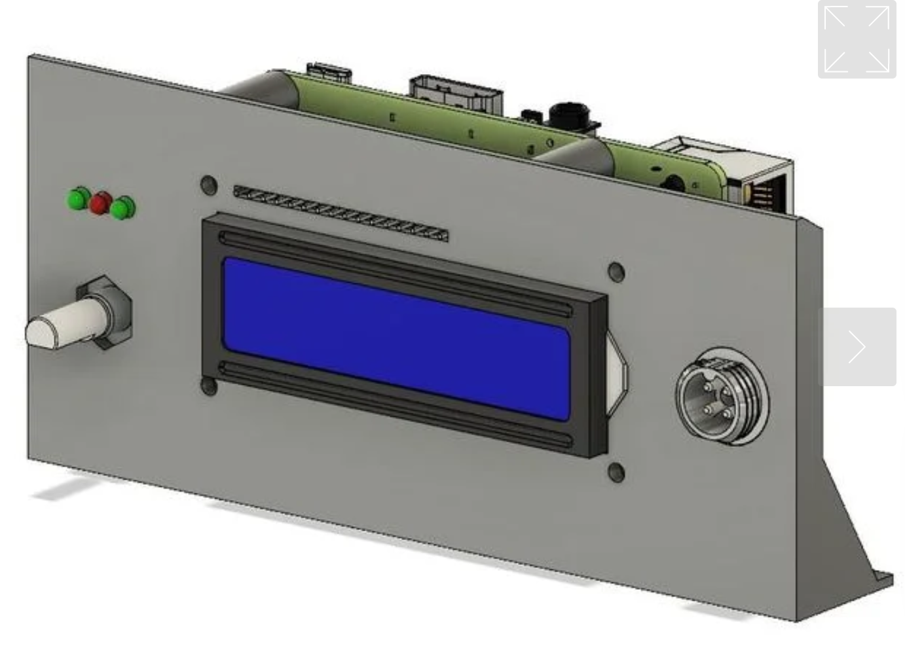
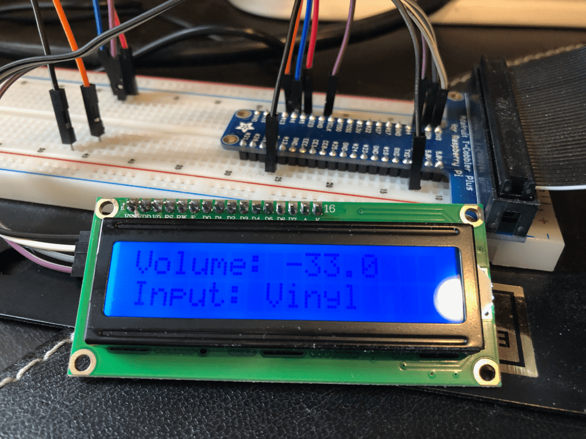

Previously: [Part 1](https://paulcutler.org/posts/2021/07/introducing-pi-dial-part-one/) [Part 2](https://paulcutler.org/posts/2021/07/introducing-pi-dial-part-two-oops/) [Part 3](https://paulcutler.org/posts/2021/07/introducing-pi-dial-part-three-prototyping/)

While it may sound like I’ve been on a tear creating the pi-dial, the truth is somewhere in-between.  While I’ve done a lot in the last month, there have been enough times where I’ve wandered down a rabbit hole doing research and getting distracted.

One of those times was thinking about how I was going to mount this contraption.  One idea I had was to build a custom wooden box / case to mount the Pi in.  The rotary encoder is panel mountable, so I thought I could drill a hole in the wood.  I don’t have any wood working skills to really speak of, so I looked at this as another learning opportunity.  (Like I need another learning project!)

I spent a lot of time on the [MakerBot Thingiverse](https://www.thingiverse.com/) website browsing plans for 3D printers.  I found a few plans that include a case for the Raspberry Pi and a hole the rotary encoder, but the plans were almost ten years old and for the original Raspberry Pi version 1 which hasn’t been around forever and all I have is a bunch of Raspberry Pi version 2s.

But then I found [this plan](https://www.thingiverse.com/thing:3005091) that reminds me of an old car stereo.  It would sit nicely on my desk:

If you click through, I’m not sure I’ll use the power step down converter for the back plate, but it might be a nice project as well.  That’s a problem for future Paul to deal with. I sent the plans to my friend with the 3D Printer and I’ll have to ask him if it’s possible to make the knob on the right equal to the one on the left, which is the rotary encoder (so I can use two of them).

Now I need to LCD to match the design.  Another few hours of reading and research and this doesn’t look as hard as I thought it might be.

I looked at the [Adafruit Pi Plate](https://www.adafruit.com/product/1115), which includes a 16x 2 screen (16 characters per row, 2 rows).  It also has five buttons, and I don’t need that many.  I did find some interesting 3D printer cases for it, but I’d rather use a rotary encoder to control the volume than buttons.

Looking at some of the tutorials on-line, I went with a cheap [two-pack from Amazon](https://www.amazon.com/GeeekPi-Character-Backlight-Raspberry-Electrical/dp/B07S7PJYM6).  If you look at the photo below, you can see the LCD has 16 pins across above the LCD, but it also has an I2C interface on the left side where you can see the 4 pins coming out of it.

The great thing about it using I2C - inter-integrated circuit - is that it makes using peripherals like this LCD a snap.  Out of the 40 pins on a Raspberry Pi, only 4 are I2C, so you have to plan ahead on how you’re going to connect things to the Pi when using multiple peripherals, like 2 rotary encoders and an LCD.  The rotary encoders were easy to hook up just using the jumper cables, so I didn’t have a concern.

My LCD came with the default address, 0x27, and I had it working within an hour using the `RPi_GPIO_i2c_LCD` library.

In less than [50 lines of Python](https://github.com/prcutler/pi-dial/blob/main/i2c_test.py), I was able to create a `while` loop using the `denonavr` library.  Every 5 seconds in my prototype code it polls the receiver asking it for the current volume and current input and displays on the screen above.

Voila!  This was probably the easiest part of the project so far.

*Next up:  A detour with Python’s `async`*
