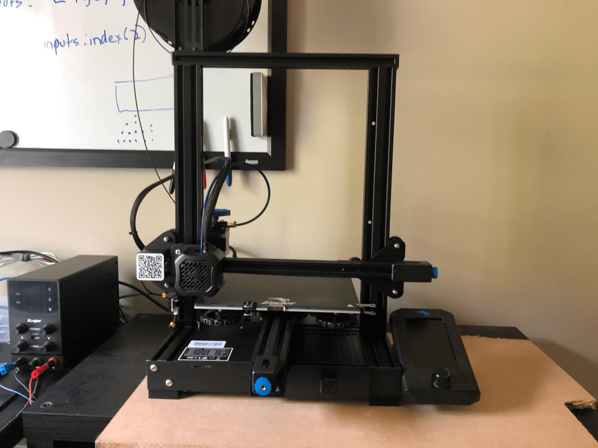

It’s been a little bit since I posted an update about the pi-dial project.  Don’t worry, I have some updates to share soon.

In typical fashion, I’ve been distracted by two new projects.  That, and I’ve been putting off blogging.  I probably need to do a better job keeping notes of the updates I want to write about because I’ve been doing it all from memory.  And the longer I go between working on the project and writing about it, the less I remember.  

The new projects?  I have a CircuitPython project to share soon and I bought a 3D printer last Wednesday.  The printer has taken up most of my time in the last few days and I’ll share more about that, too.

