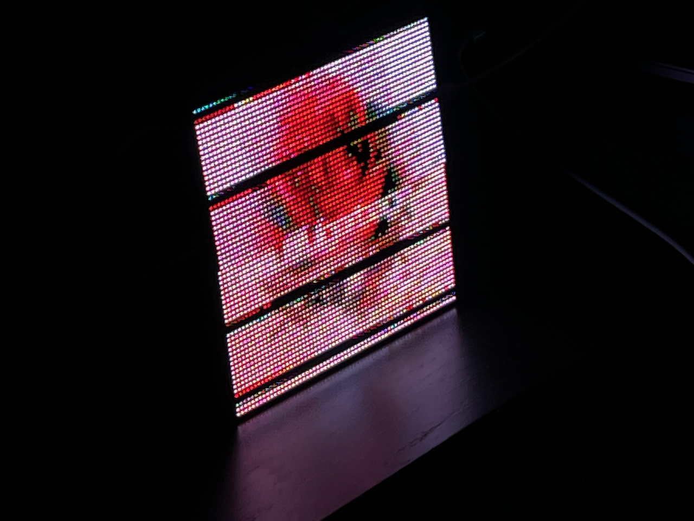

With silversaucer.com now up and running with about half the functionality, I’ve turned my attention to try and displaying a bitmap on the Adafruit matrices.

I have two 32x64 matrices and have soldered my Adafruit Matrix Portal so it can display a 64x64 image.  The first thing I learned was that the bitmap’s size correlates directly to the matrix.  Thanks to Dan in Adafruit’s Discord server, I discovered the ImageMagick library can handle turning any image into a bitmap with a couple command line arguments.  I ran through some random albums, downloaded the artwork and converted about half a dozen of them to bitmaps.  They’re so cute and tiny!

And it looks like this: 

I’ve spent most of the week trying to do this.  I can display a 64x64 bitmap from the filesystem, I can do a slideshow and display multiple bitmaps, but the one thing I can’t do:  download and display over the internet.  I’m not even able to download it, save it to disk, and then display it.  One of the challenges of working with CircuitPython is staying within the memory limits as it’s a microcontroller, not a full blown computer like a Raspberry Pi is.

I’m trying to do the following:

1. Parse the Discogs JSON to get the URL to the album’s cover art.  (You must be authenticated to get a link to artwork).  
2. Take the image and convert it to a bitmap.  ImageMagick can do this, so I need to save the jpg to the filesystem and then convert it and save it again (or display it in memory).
3. Send a link to the image or bitmap to my local network to the device powering the LED Matrix.
4. Display the bitmap on the LED Matrix

Even with almost 40k free, I run out of memory trying to download and display an 8k bitmap.  I’ve tried to stream it without any luck.  None of the CircuitPython libraries (`image load` seem to work no matter how I call it over the network.  A few folks helped me out in Discord with some pointers, especially around showing how much memory is available which was super helpful, but no luck.

If there is one lesson I have learned since trying to port the sound reactive code for my speaker stand in trying to go analog instead of digital, is use the right tool for the right job.  I spent dozens of hours tearing apart CircuityPython code and was never able to make it work.  After spending a few days on this, I’m not going to make that mistake again.

If CircuitPython can’t display the image easily, let’s try a Raspberry Pi.  I still have a bunch of them just lying around and the [Matrix Bonnet](https://www.adafruit.com/product/3211) is only $15, so I put in an order to Digikey yesterday.  (Both of us being in Minnesota, their products get to me quickly).

Now I have a couple more design decisions to make.  What kind of MQTT message do I want to send to my Pi locally?  The image link?  Convert the image to a bitmap and save on my DigitalOcean  droplet or on my local Pi?

Longer term I’m leaning towards storing all this data in a database.  The Discogs API seems a touch slow when returning a random album, and this would speed it up considerably, especially when loading and displaying an image.  More updates next week after the Pi bonnet comes.

