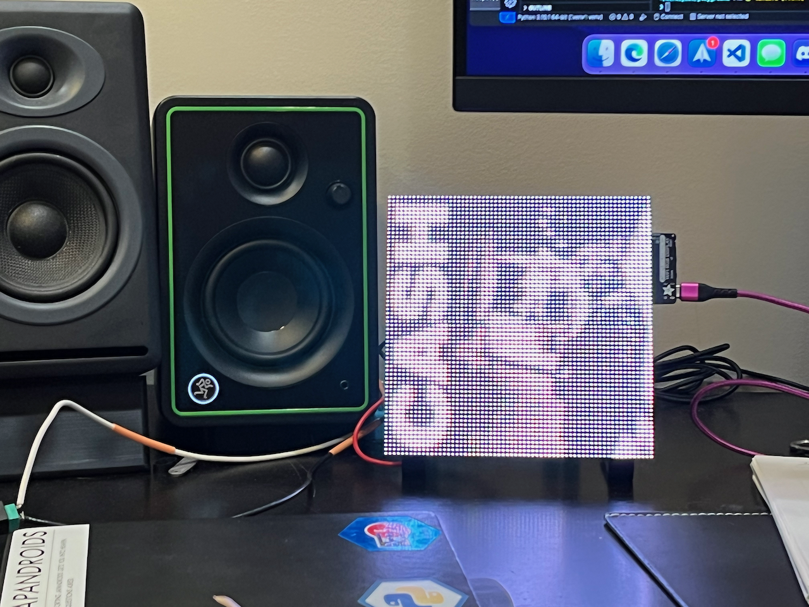

## Now Working in CircuitPython!
When we last left our hero, he was [unable to get a 8k image to load over the internet and display an image](https://paulcutler.org/posts/2021/12/the-right-tool-for-the-right-job/) on the MatrixPortal and 64x64 LED….

I decided to take a different tack and I ordered a [Matrix Bonnet](https://www.adafruit.com/product/3211) for the Raspberry Pi from Digikey (Adafruit was out of stock).  Let's just say that didn't work at all and I have [reason to believe it’s the Bonnet](https://forums.adafruit.com/viewtopic.php?f=50&t=186760) after trying it on two different Raspberry Pi 2s and a Pi Zero 2.

I don’t remember what I was doing this morning, but I was back to playing with the matrices and the MatrixPortal.   Danh in the Adafruit Discord, who had already helped me previously by recommending ImageMagick for my project, helped me out again.  He shared a code sample making it easy to switch the MatrixPortal from read / write to read only, as only it or a computer should write to it at a time.  I accidentally reset my MatrixPortal this morning and wiped it.  I had some regular Python code to write the image to disk, so I tried it out on the MatrixPortal and what do you know - it worked!

I was able to initialize the network, connect to my web server, download the 64x64 image, write it to disk, and display it on the matrix.

That was a pleasant surprise, so now I’m on to the next step: converting the JPEG image from Discogs to a tiny bitmap that can be displayed in CircuitPython.

I wasn’t sure if I could use ImageMagick in Python and a couple search engine queries later I was using the [Pillow library](https://python-pillow.org/).

It’s this easy:

```
from PIL import Image


img = Image.open("cash2.jpg")

new_img = img.resize((64, 64))
rgb_img = new_img.convert('P')

rgb_img.save('cash2.bmp')
```

It takes the image, in this example the cover art to one of Johnny Cash’s American Recordings albums that I had saved as `cash2.jpg` locally and converted it to a tiny bitmap.  I transferred it up to my web server and it works!  Here is the Man in Black himself in his 8 bit glory:



It’s exciting to have solid progress.  Now I need to integrate the `Pillow` code into FastAPI.  After that is a big chunk of work in figuring out how to get MQTT to work, but more on that later.


