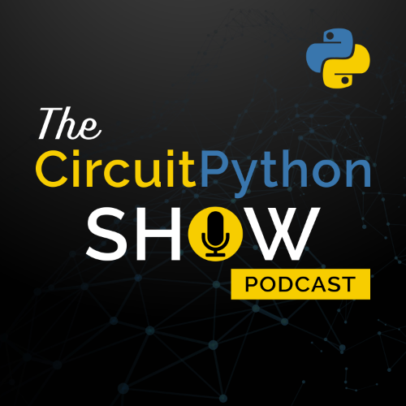

I’ve decided to start a podcast!  The very original show name is The CircuitPython Show, about - you guessed it - CircuitPython!  More specifically, about the people and the cool things they're doing with CircuitPython.

The show will be a question and answer style interview podcast.  I’m shooting for each episode to be about 30 minutes.  I’ll interview a person in (or around) the CircuitPython community and it will give listeners an opportunity to learn more about that person.

I’m still a ways out from releasing episodes.  I’m planning on six episodes for season one and I’ve been emailing invites out to potential guests.  So far I have three confirmed guests so I still have a little work to do.  If you have any guest recommendations or want to be on the show, please let me know! (Really, please!)

I’m brand new to all this and I’m sure it will take me a few episodes to find my “voice”.  I’m recording a teaser trailer and already I’m learning how hard this is!    But if you’ll stick with me, I’m guessing the episodes will get better as I go along.  I've really enjoyed my time in the CircuitPython community, especially the Adafruit Discord channel, and thought there are enough interesting people to make a podcast about those people and their projects.

A special shout-out to Michael Kennedy, host of the [Talk Python To Me](https://talkpython.fm) podcast.  When I was considering doing this he took time out of his schedule to answer some questions for me and make some introductions.  (And we’re both using Boostrap Dark for our websites, the similarity is unintentional!) 

You can find out more at the [newly launched website](https://circuitpythonshow.com) (running FastAPI of course) or [follow the show on Twitter](https://twitter.com/circuitpyshow), which I recommend as that’s my platform of choice.  I’ll probably drop some spoilers and other info on Twitter first.

I’ll blog some more when the teaser trailer is out or I have other news.  Until then, I have a lot of work to do…