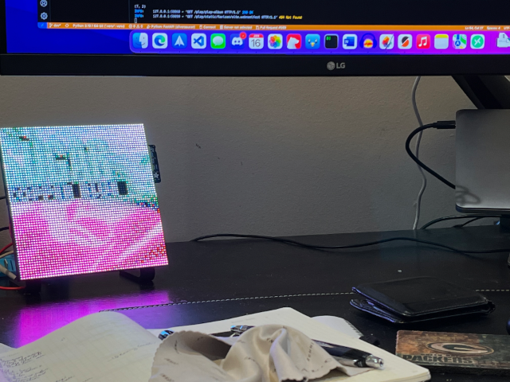
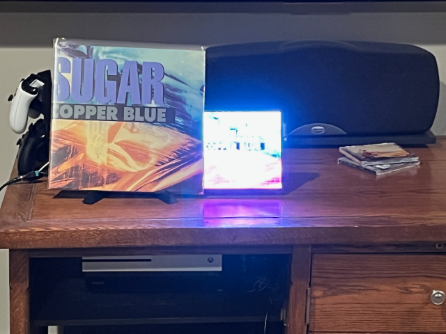

When I’m not doing something podcast related, I’m still trying to find time to code.

With the football games in the background, I was able to build off my last post, which would convert an image to Bitmap if I had it.

I made sure I had it today.  Using the `requests` library, I implemented the ability to go get the photo and pass it to Pillow to conversion.  The process looks like this:

1. Request image URL location from Discogs via the authenticated API
2. Get the `request` object and write it to disk
3. Use the object to pass it to Pillow, which converts and saves it.

It was easier than I expected.  I have two things to do:

1. Only download the image if I’m the one logged in
2. I was only to save it in the default directory, I need to store the the images in the `static` directory.

I’m not 100% sure the project is going to work.  Technically, it will work.  But I should really be about 12 feet away from the LED matrix to see the display in the right light.  Currently I’m about three feet away and it doesn’t look the best.  Looking around my home office, there isn’t a great place put it.  I also need to learn how to take better pictures of LEDs.

Those two things plus wiring up MQTT equals done.   Getting close now.   The pictures look much better in person.

