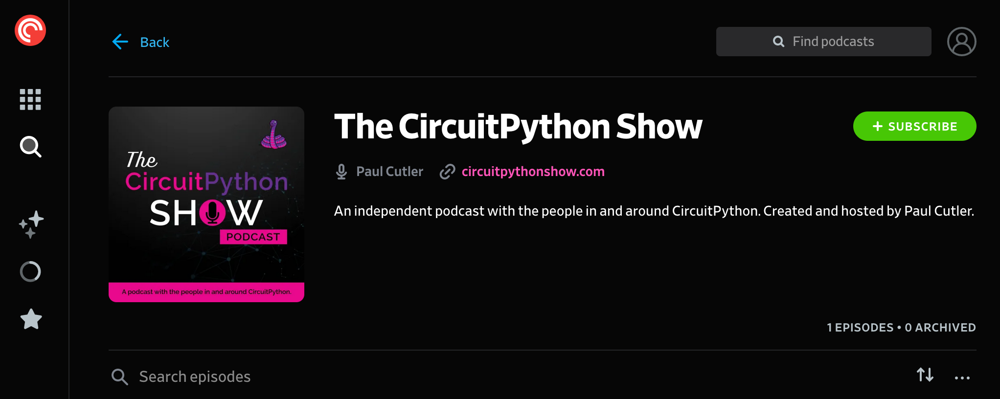

I mentioned in my [blog post introducing the podcast](https://paulcutler.org/posts/2022/01/introducing-the-circuitpython-show/) that I had a lot to do to get the podcast ready.  I may have underestimated the amount of work, but progress is being made!  The podcast was submitted to all of the major podcast networks today, including PocketCasts (my personal player of choice), Google, Apple Podcasts, and everywhere you'd expect to listen to a show.  If you want to add the show manually to your podcast player, [here is the link](https://feeds.captivate.fm/circuitpythonshow/).  

This is the thirty second teaser trailer that shares some of the guests who will joining me in Season 1 of the show.

The biggest way to help the show right now is to subscribe to the link or search for the show in your favorite podast player (when it appears), and if you like what you hear after the show debuts, please consider writing a review.

More to come soon!