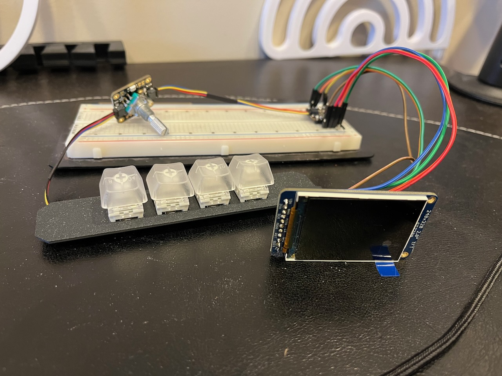

I couldn’t resist the recent holiday sales and I bought a few parts for my next two CircuitPython projects.

First up, is re-creating my [Pi-Dial project](https://paulcutler.org/project/pi-dial/) using CircuitPython on a microcontroller instead of a Raspberry Pi and Python.  This project controls Zone 2 of my home theater receiver, which is my home office.

Parts used include:
* [ESP32-S3 microcontroller](https://www.adafruit.com/product/5426) (because it has WiFI and I already had a couple on hand)
* [4 key NeoKey](https://www.adafruit.com/product/4980) (used to change the inputs, such as CD, Phono, or Tuner and mute)
* 1 Rotary encoder (to change the volume)
* 1 [2” TFT screen](https://www.adafruit.com/product/4311)

I already had a prototype working with the NeoKey and rotary encoder using the ESP32-S3.  CircuitPython can send serial commands to my Denon receiver and I can do all of the functions I need, including changing the volume, inputs, and muting or unmuting the receiver.

For an enclosure, I’m going to use repurpose the [WalkMP3rson project from Adafruit](https://learn.adafruit.com/walkmp3rson-personal-mp3-tape-player) and 3D print a retro Walkman style player.  I’ll need to modify it to permanently add the USB-C cable for power as it won’t be battery operated.

The biggest thing I have to learn is `displayio`.  I don’t have any experience using displays in CircuitPython, but I’m excited because the WalkMP3rson project has a bunch of code I’ll be able to re-use.  

My second project will be an IoT sensor to detect when I’m running low on water softener salt.  I purchased a [Time of Flight sensor](https://www.adafruit.com/product/3967) that can measure the distance and connects to an [ESP32-S2 Feather](https://www.adafruit.com/product/5000). It will then report back via MQTT the current measurement.  I’m already running Home Assistant and I’ll set it up to report the measurement daily to my dashboard.  I’ve used MQTT in one other project, but I’ve never integrated with Home Assistant.  The biggest challenge so far is finding a 3D printed case that can hold both the Feather and a battery.

Those should keep me busy for a while.  At least over holiday break!