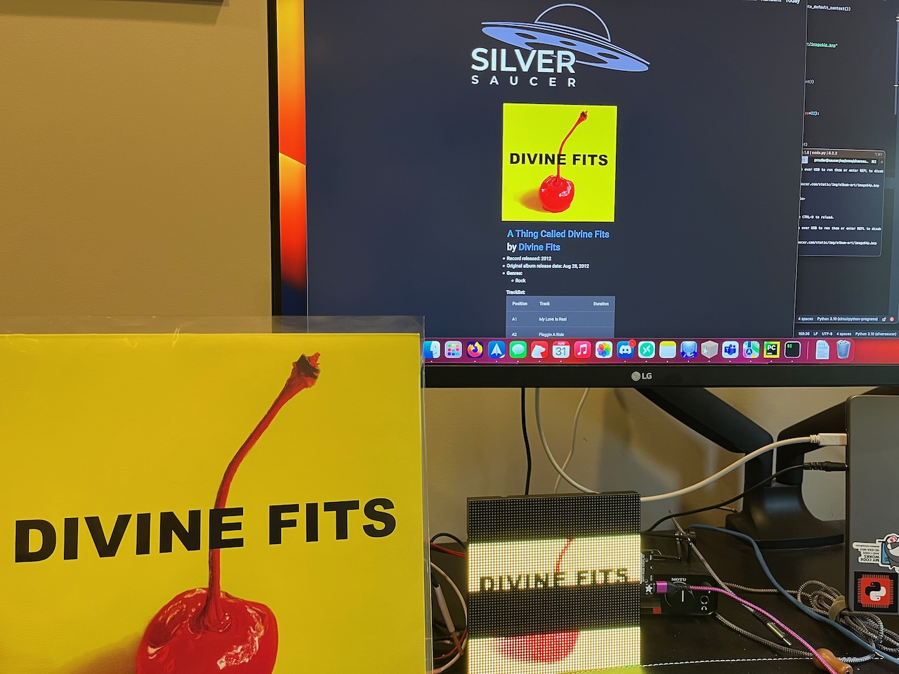

A year and a half ago I [made some progress on displaying album art on a MatrixPortal and 2 32x64 RGB matrices](https://paulcutler.org/posts/2022/01/led-matrix-progress/) using CircuitPython.  I was never really happy with the results and using two 32x64 matrices instead of one 64x64 matrix was difficult.  I moved on and re-created the project using a PyPortal Titano. It worked well: when I chose an album I wanted to listen to SilverSaucer.com, my FastAPI web app would convert the image and send a MQTT message.  The PyPortal would listen for the message, and when a new message arrived, download and display the album art along with a Winamp skin that also showed the artist and album name.  I should have blogged it and taken a picture!

When Adafruit announced the new [S3 MatrixPortal](https://www.adafruit.com/product/5778) with so much memory - 8MB flash and 2 MB of SRAM, I decided to try again.  My hope was that with that much memory, I could download and load the image into memory without having to save it.  

I haven't figured out how to do it without saving the image to the MatrixPortal yet, but I was able to repurpose my original code and had it up and running in just a few minutes.

Now came the hard part: adding gamma correction to the image so it looks closer to normal on the MatrixPortal and not washed out.  Adafruit has a great [Learn Guide for Image Correction for RGB LED Matrices](https://learn.adafruit.com/image-correction-for-rgb-led-matrices).  The guide includes a [CPython program](https://raw.githubusercontent.com/adafruit/Adafruit_Media_Converters/master/protomatter_dither.py) that uses Python's PIL / Pillow library to manipulate the image and some logic to apply gamma correction.

I needed to re-create that program, which used command line arguments where you would pass the image name to the program, as one function within my FastAPI app.  It took a few days of banging on it (and a few hours lost to a wrong indent(!)), but I got it.  The `get_discogs_image` function downloads the given image and converts it from a 600px image to 320 x 320px (for the PyPortal) and a 64x64 image for the MatrixPortal. The `process_image` function then takes the 64x64 image and applies gamma correction and saves a new copy (which the MatrixPortal will download and display).

Some albums look a lot better than others.  Considering it's a 64x64 image, it's practically pixel art at this point.  It's too bad that it's difficult to photograph RGB matrices, but here is a picture showing Divine Fits' album, it being chosen on SilverSaucer.com, and the converted image being displayed on the MatrixPortal.

