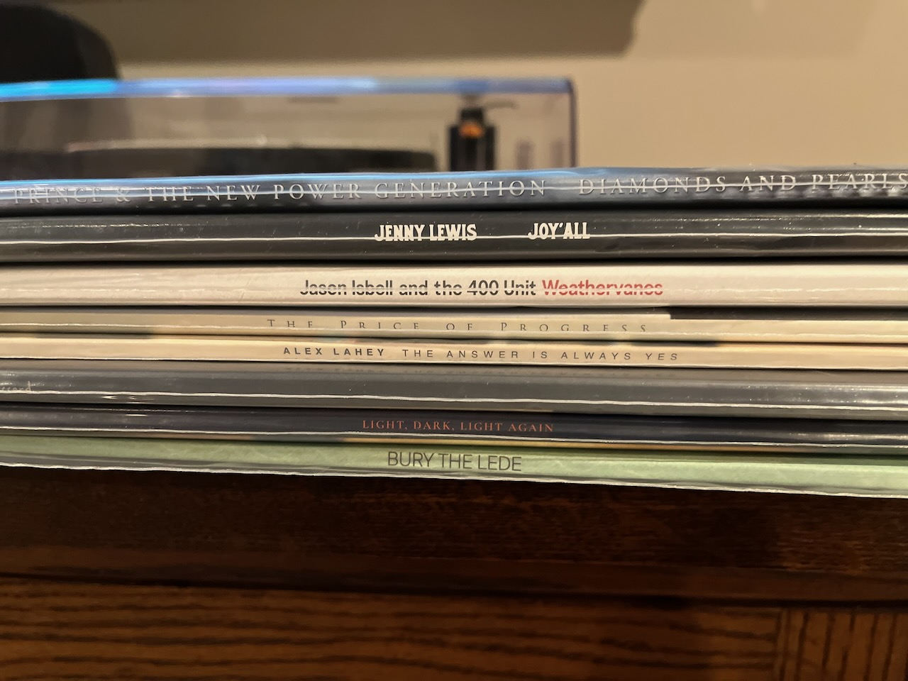

My favorite album of 2023 isn’t in the picture as I’m waiting for the deluxe box set that comes out in early March, 2024.  Peter Gabriel’s i/o, his first album of new music in over 20 years, came out in early December and I have literally listened to nothing but this.  So much so that Apple updated its 2023 Replay and the record became my most played streaming album of the year in under a month.

Like [last year](https://paulcutler.org/posts/2022/12/favorite-albums-of-2022/), here’s the rest of the list in no particular order:

* Jenny Lewis - Joy Y’all:  Jenny Lewis was back with a strong effort.  At just over 30 minutes the record was short and sweet but full of catchy songs.
* Jason Isbell and the 400 Unit - Weathervanes:  Jason Isbell self-produced this album and cranked the electric guitars a bit more than in past albums.
* The Hold Steady - The Price of Progress: You either love or hate Craig Finn’s voice.  But there is no denying he is a master storyteller.
* Alex Lahey - The Answer is Always Yes: Alex Lahey’s third album is just a rockin’ good time.
* boygenius - The Record: I don’t know what I can say that hasn’t already been said on every Best of 2023 list already.  The supergroup of Julien Baker, Lucy Dacus, and Phoebe Bridgers followed up their debut EP with a wonderful album.
* Angie McMahon - Light, Dark, Light Again: If it hadn’t been for Peter Gabriel, this would have been my album of the year.  There was no sophomore slump for this singer / songwriter out of Australia.  I really hope more people get to know her and her music.
* Dessa - Bury the Lede: Minneapolis poet / author / singer / rapper Dessa was back with Bury the Lede and did not disappoint.

* Favorite repress / reissue: Prince and the New Power Generation - Diamond and Pearls: I almost regret not buying the deluxe box set of this album.  The quality and the mix of this album, originally released in 1991, is hands down the best mixed album I heard all year.  I listened to the original a few times before picking this up and was blown away the first time I put it on the turntable.
