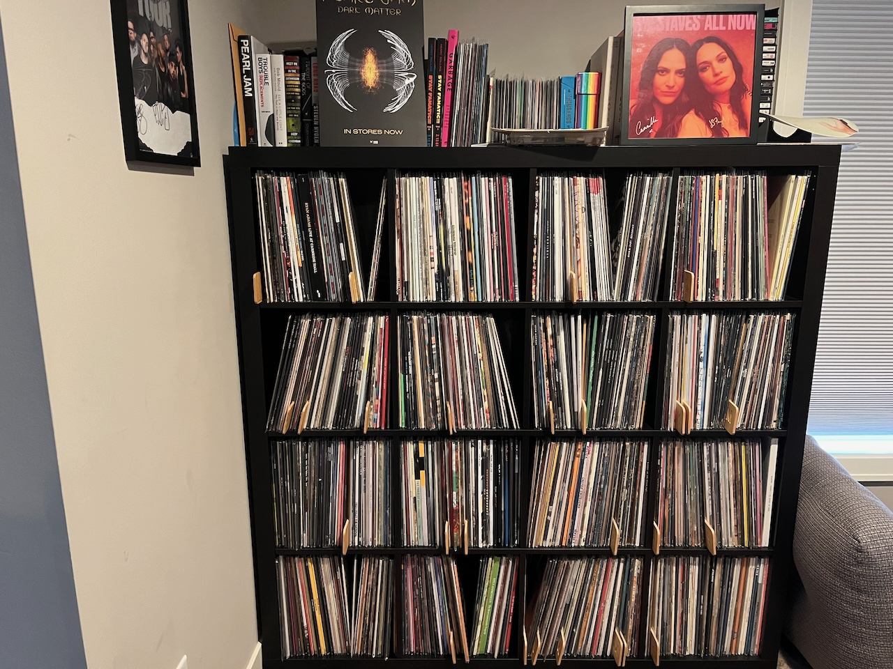

Fifteen years ago today on April 18th, 2009 I started my record collecting journey.  It's an easy day for me to remember as it was the second annual [Record Store Day](https://en.wikipedia.org/wiki/Record_Store_Day).  I still remember it like it was yesterday.  That Saturday afternoon I'd pick up the turntable, so I headed out to the local record store, Down in the Valley, first.  There I picked up Neko Case's [Middle Cyclone](https://www.discogs.com/release/2237070-Neko-Case-Middle-Cyclone) on clear vinyl and a handful of used records, though I don't remember which ones I bought.  I never imagined my collection would grow like it has.

I remember that people thought I was a bit crazy to get back into records.  I wouldn't have imagined vinyl outselling CDs, but [vinyl has for the last two years](https://www.theverge.com/2024/3/26/24112369/riaa-2023-music-revenue-streaming-vinyl-cds-physical-media).

My records bring me great joy - I've [built apps](https://silversaucer.com) around them, cataloged them on [Discogs](https://www.discogs.com), and I listen every day.  There's nothing better than putting on a pair of quality headphones, closing your eyes, and spinning a record.