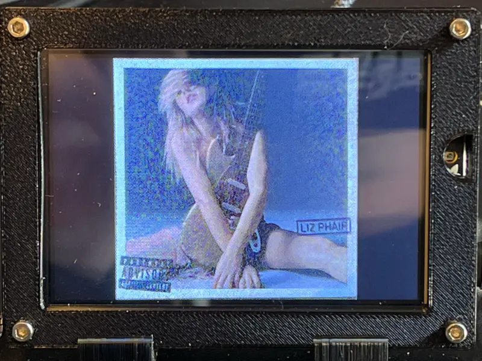

+++
# Date this page was created.
date = "2022-05-16"

# Project title.
title = "PyPortal Album Art Display"

# Project summary to display on homepage.
summary = "Display Album Art on a PyPortal from SilverSaucer.com"

# Optional image to display on homepage (relative to `static/img/` folder).
image_preview = ""

# Tags: can be used for filtering projects.
# Example: `tags = ["machine-learning", "deep-learning"]`
tags = ["CircuitPython", "Python", "FastAPI", "PyPortal"]

# Optional external URL for project (replaces project detail page).
external_link = ""

# Does the project detail page use math formatting?
math = false

# Optional featured image (relative to `static/img/` folder).
[header]
# image = "project/speakerstand-lights/speaker-feather.png"
# caption = "Adafruit NeoPixel Feather"

+++

# PyPortal Album Art

## Project Overview
The PyPortal Album Art project works in combination with my SilverSaucer project.  SilverSaucer.com is my website, written using Python and FastAPI, that integrates with the Discogs API and lets me choose an album from my record collection at random.  The album’s covert art is then automatically displayed on the PyPortal. 




## History
The project initially started out in the fall of 2021 using a 64x64 LED matrix (2 x 32x64) with an Adafruit MatrixPortal.  Unfortunately, I was disappointed by the image detail and the display needed to be farther away from me on my desk to be viewed properly.  I purchased to a PyPortal in January 2022 to take advantage of its screen quality, but traded down in size.

## Details
The project requires a web server running FastAPI, a MQTT broker, and a PyPortal.  You will also need a Discogs API key.

When I am logged into silversaucer.com and press the “random” button, the FastAPI web app connects to Discogs, picks an album at random, downloads the album art, converts it to a bitmap, makes it available for download, and sends a MQTT message that a new image is available.

Upon receiving the MQTT message, the PyPortal connects to silversaucer.com, downloads and displays the bitmap.  The PyPortal then waits for another MQTT message and refreshes the screen upon receiving a new image.


### FastAPI
The FastAPI web application need to have MQTT and Pillow configured.  Upon loading the `play-album` page, in addition to loading the covert art image from Discogs, two additional methods are needed.  The first converts the 600x600 image from Discogs and converts it from a JPG to a BMP: 

```
async def get_discogs_image(release_image_url):
    image_dl = requests.get(release_image_url, stream=True).raw
    download = Image.open(image_dl)
    download.save('static/img/album-art/image_600.jpg')

    img = Image.open('static/img/album-art/image_600.jpg')
    img.quantize(colors=16, method=2)
    smol_img = img.resize((320, 320))
    convert = smol_img.convert(mode="P", palette=Image.WEB)
    convert.save('static/img/album-art/image_300.bmp')
```

The second sends a MQTT message to the MQTT broker that a new image has been converted and saved.

### CircuitPython

The PyPortal listens for the MQTT message and when received, downloads the image using `requests`.   Requests’ `iter_content` must be used to stream the image download otherwise the PyPortal will run out of memory and display an error:

```
if response.status_code == 200:
    print("Starting image download...")
    with open("albumart.bmp", "wb") as f:
        for chunk in response.iter_content(chunk_size=32):
            f.write(chunk)
        print("Album art saved")
    response.close()

    display = board.DISPLAY
    maingroup = displayio.Group()  # everything goes in maingroup
    display.show(maingroup)  # show main group
    bitmap = displayio.OnDiskBitmap(open("albumart.bmp", "rb"))
    image = displayio.TileGrid(bitmap, pixel_shader=bitmap.pixel_shader)
    maingroup.append(image)  #

```

## Challenges
The first iteration of the PyPortal Album Art project attempted to use Adafruit’s builtin `pyportal` class and Adafruit IO to automatically handle image conversion.  Using [John Park’s NASA Image of the Day learn guide](https://learn.adafruit.com/pyportal-nasa-image-of-the-day-viewer/code-pyportal-nasa-image-viewer#project-code-5-13) as a basis, I first used FastAPI to expose a JSON endpoint with the location of the Discogs image and pass it to the PyPortal class and also display the artist and album name.  Unfortunately, I was unable to get the PyPortal class to work inside of the MQTT loop and the network would fail.  

```
DATA_SOURCE = "https://silversaucer.com/album/data"

# There's a few different places we look for data in the photo of the day
image_location = ["image_url"]
artist = ["artist"]
album = ["album"]

# the current working directory (where this file is)
cwd = ("/"+__file__).rsplit('/', 1)[0]
pyportal = PyPortal(url=DATA_SOURCE,
                    json_path=(artist, album),
                    status_neopixel=board.NEOPIXEL,
                    default_bg=cwd+"/nasa_background.bmp",
                    text_font=cwd+"/fonts/Arial-12.bdf",
                    text_position=((85, 260), (85, 280)),
                    text_color=(0xFFFFFF, 0xFFFFFF),
                    text_maxlen=(50, 50), # cut off characters
                    image_json_path=image_location,
                    image_resize=(320, 320),
                    image_position=(80, 0))
```

If you use the NASA Image learn guide, you’ll also see that I used the filesystem as write-able cache, which isn’t really recommended, but I needed the drive writeable to save the album art image.

After a long period of inactivity, the MQTT loop will sometimes fail due to a networking problem or timeout and the PyPortal needs to be reset.


## Next steps
Displaying the album art automatically is just the first step.  I may add a Winamp player image to the player and put the album art directly under it.  I could then add a text box with the artist name and album name inside the Winamp image.  See foamyguy’s excellent [PyPortal Winamp MP3 Player project](https://learn.adafruit.com/pyportal-winamp-mp3-player).  If not, I’ll display the same info in the bottom left hand corner, similar to classic MTV.

I also need a way for it to download the image on first boot or reset without a MQTT message.

## Credits
In no particular order, thank you to:
* John Park for the wonder NASA Image of the Day learn guide which got me going quickly.
* Tod Kurt, aka Todbot, for the code sample using  requests’ `iter_content` to be able to download the image in chunks.
* The CircuitPython community for answering my questions.