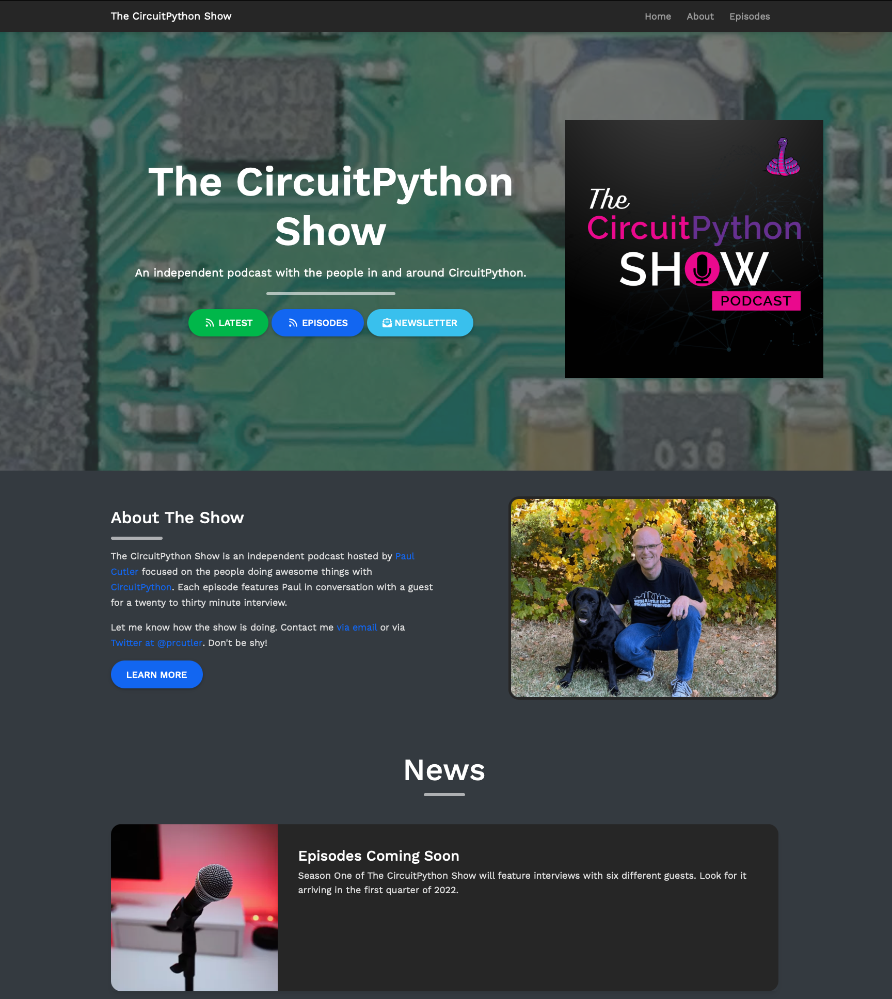

+++
# Date this page was created.
date = "2022-01-15"

# Project title.
title = "The CircuitPython Show"

# Project summary to display on homepage.
summary = "A podcast with the people in and around the CircuitPython community."

# Optional image to display on homepage (relative to `static/img/` folder).
image_preview = "project/cps/cps.png"

# Tags: can be used for filtering projects.
# Example: `tags = ["machine-learning", "deep-learning"]`
tags = ["circuitpythonshow, "Python", "circuitpython", "podcast"]

# Optional external URL for project (replaces project detail page).
external_link = ""

# Does the project detail page use math formatting?
math = false

# Optional featured image (relative to `static/img/` folder).
# [header]
image = "project/cps.png"
caption = "The CircuitPython Show"

+++

The CircuitPython Show is an independent podcast with the people in and around the CircuitPython community.  I host an appoximately half hour conversation with people doing awesome things with CircuitPython or sometimes around CircuitPython.  This could include 3D Printing, circuit boards, and more.

The show will debut in the first quarter of 2022.

Learn more:

* [The CircuitPython Show](https://circuitpythonshow.com)
* [Site Credits](https://circuitpythonshow.com/about)
* [CircuitPython](https://circuitpython.org)
