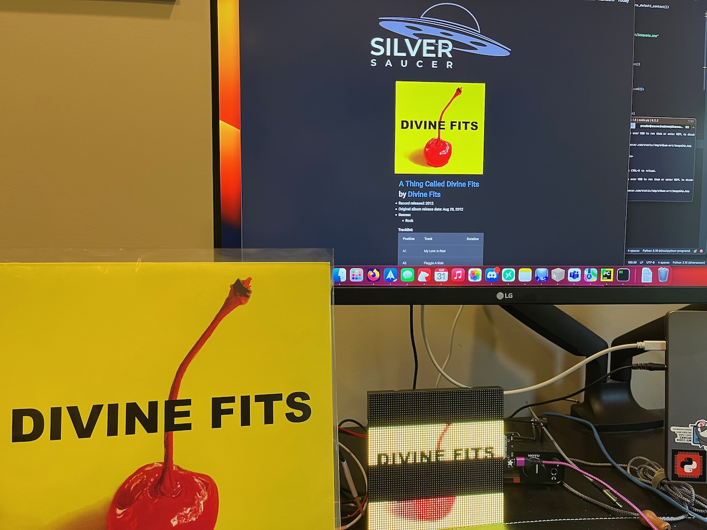

+++
# Date this page was created.
date = "2023-08-29"

# Project title.
title = "MatrixPortal Album Art"

# Project summary to display on homepage.
summary = "Display album art on a 64x64 RGB Matrix Panel"

# Optional image to display on homepage (relative to `static/img/` folder).
image_preview = ""

# Tags: can be used for filtering projects.
# Example: `tags = ["machine-learning", "deep-learning"]`
tags = ["CircuitPython", "FastAPI", "Python"]

# Optional external URL for project (replaces project detail page).
external_link = ""

# Does the project detail page use math formatting?
math = false

# Optional featured image (relative to `static/img/` folder).
[header]
image = "project/denon-remote-control/divinefits.jpeg"
caption = "The Divine Fits record, the record's alabum art on a screen, and displayed on a MatrixPortal"

+++

##  Project Overview

The `MatrixPortal Album Art` project loads and displays a remote image from a webserver and automatically updates when a new album is picked on the webserver.

Source code: [GitHub](https://github.com/prcutler/circuitpython-albumart)

## About

In the fall of 2021 I started to play around with loading an image on two 32x64 RGB Matrices.  That project eventually turned into the [PyPortal Album Art](https://paulcutler.org/project/albumart/), which displays the album art along with a Winamp player showing the name of the artist and album.  I used the PyPortal because I didn't care for the image quality of the RGB Matrix because it used a 64x64 image, which is practically pixel art at that resolution. Much later when I came across this [Adafruit Learn Guide on gamma correction for the RGB Matrix](https://learn.adafruit.com/image-correction-for-rgb-led-matrices) did I have an aha moment of how to proceed.

The image used is generated by my [FastAPI Python application](https://github.com/prcutler/silversaucer) and the image is resized using Pillow by the web app.  I was then able to adapt the gamma correction code from the above learn guide and have that run by the web app, too.  But for the purpose of this code, you can use any image on the web by just changing the URL in the code.

Using MQTT, the MatrixPortal listens for a message created by the web app when a new album is chosen and then saves and loads the image on the RGB Matrix.  If you wish to use MQTT to listen, you will need to create an Adafruit IO account.

### Parts Needed

* [Adafruit S3 Matrix Portal](https://www.adafruit.com/product/5778)
* [Adafruit 64x64 RGB Led Matrix](https://www.adafruit.com/product/3649)
* Power adapter

