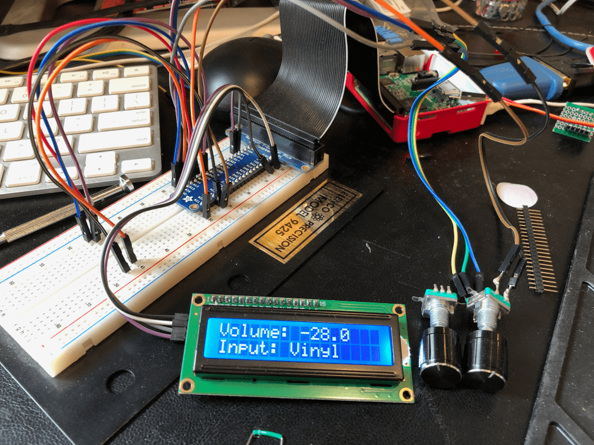

+++
# Date this page was created.
date = "2021-08-03"

# Project title.
title = "pi-dial"

# Project summary to display on homepage.
summary = "A hardware project to control a Denon Audio-Video Receiver using a Raspberry Pi, rotary encoders, and an LCD screen."

# Optional image to display on homepage (relative to `static/img/` folder).
image_preview = "project/pi-dial/breadboard.png"

# Tags: can be used for filtering projects.
# Example: `tags = ["machine-learning", "deep-learning"]`
tags = ["pi-dial", "Python", "raspberry pi"]

# Optional external URL for project (replaces project detail page).
external_link = ""

# Does the project detail page use math formatting?
math = false

# Optional featured image (relative to `static/img/` folder).
[header]
image = "project/pi-dial/pi-dial.png"
caption = "pi-dial prototype on the breadboard"

+++

The `pi-dial`  project originally started as a copy of the [Media Dial project](https://learn.adafruit.com/media-dial) on Adafruit.  After it was pointed out to me that my CircuitPython devices didn't have networking, I turned to a Raspberry Pi.  The Raspberry Pi has two rotary encoders connected, one to control the volume and the other to change the input for my network connected Denon Audio-Video Receiver (AVR). 

I've been [blogging my journey](https://paulcutler.org/tags/pi-dial/) so far (with more blog posts to come as of August 2021) in creating the project.  As of August 2021 the code is complete and I am now just waiting to 3D print the enclosure.  You can view the [source code on Github](https://github.com/prcutler/pi-dial).

A special thank you to the [Home Assistant](https://www.home-assistant.io/) and [`denon-avr`](https://github.com/scarface-4711/denonavr) projects without whom this wouldn't be possible.

