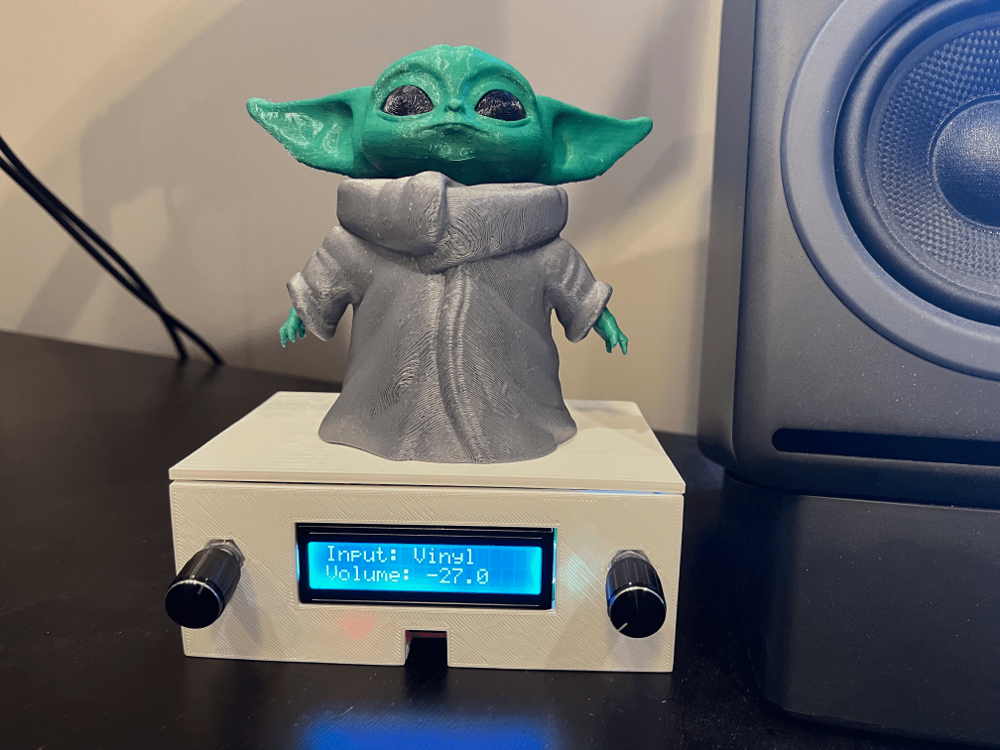

+++
# Date this page was created.
date = "2021-08-03"

# Project title.
title = "pi-dial"

# Project summary to display on homepage.
summary = "A hardware project to control a Denon Audio-Video Receiver using a Raspberry Pi, rotary encoders, and an LCD screen."

# Optional image to display on homepage (relative to `static/img/` folder).
image_preview = "project/pidial/pidial.png"

# Tags: can be used for filtering projects.
# Example: `tags = ["machine-learning", "deep-learning"]`
tags = ["pi-dial", "Python", "raspberry pi"]

# Optional external URL for project (replaces project detail page).
external_link = ""

# Does the project detail page use math formatting?
math = false

# Optional featured image (relative to `static/img/` folder).
[header]
image = "project/pi-dial/pi-dial.png"
caption = "pi-dial prototype on the breadboard"

+++

## About the project
Pi-Dial consists of two Python programs that can be used with a Raspberry Pi to control Zone 2 of a Denon audio-visual receiver (AVR).  You will also need 16x2 LCD display and two rotary encoders.  Grogu not included.  For more information you can read my series  [of blog posts ](https://paulcutler.org/tags/pi-dial/) over 2021 creating `pi-dial`.

You can view the [source code on Github](https://github.com/prcutler/pi-dial).

## Features
* Control the volume of Zone 2 using a rotary encoder
* Change the input source of Zone 2 using a rotary encoder
* Mute the receiver by pushing the button on the volume rotary encoder
* Use the LCD display to show the current input, volume, and mute status
* `systemd` service files included to start the programs at boot
* 3D Printer STLs included (unfortunately, the CAD file has been lost)

## Credits
* Originally inspired by the [Media Dial](https://learn.adafruit.com/media-dial/circuit-diagram) project on Adafruit by the Ruiz brothers
* The [denonavr project](https://github.com/ol-iver/denonavr) originally created for Home Assistant
* Way too many tutorials and guides on how to program rotary encoders and the LCD screen.  A special shout out to Adafruit for all of their project ideas and documentation.
* The [RPLCD](https://github.com/dbrgn/RPLCD) library, which is used to interface with the LCD screen.  This library was a last minute addition replacing a different library I was having issues with. 
* My best friend who wishes to remain nameless for designing the CAD files for the enclosure.
* Last, but not least, my wonderful wife, who fixed the list problem mentioned in the Notes above.

_* Grogu not included_