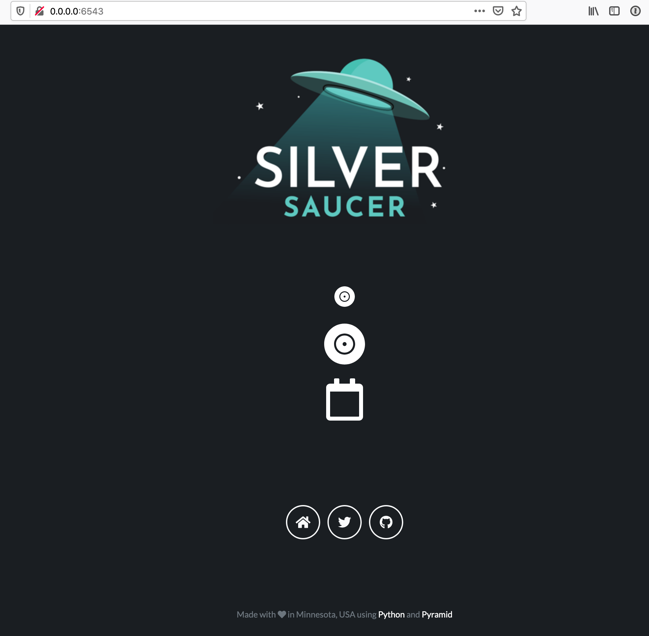

+++
# Date this page was created.
date = "2020-07-07"

# Project title.
title = "Silver Saucer"

# Project summary to display on homepage.
summary = "A website for my personal and side projects."

# Optional image to display on homepage (relative to `static/img/` folder).
image_preview = "project/silversaucer/silversaucer.png"

# Tags: can be used for filtering projects.
# Example: `tags = ["machine-learning", "deep-learning"]`
tags = ["silversaucer", "Python", "pyramid"]

# Optional external URL for project (replaces project detail page).
external_link = ""

# Does the project detail page use math formatting?
math = false

# Optional featured image (relative to `static/img/` folder).
[header]
image = "project/silversaucer/silversaucer.png"
caption = "Silver Saucer"

+++

Silver Saucer originally started as an idea for a business name ten years ago after I was laid off from what I thought was my dream job.  I quickly decided consulting wasn't for me, but I've kept the domain name all these years.  The logo is inspired from both *The X-Files* and a poem by Neil Gaiman, *The Day the Saucers Came*.

As of July 2020, the site is currently a work progress.  I am using Silver Saucer to continue to learn the Pyramid web framework, Bootstrap and CSS, and `pytest`.  Unlike NFLPool and MLBPool2, I am learning how to use Pyramid "the right way", which means without the `pyramid_handlers` package.  The design and CSS are complete and I am currently working on the Discogs API integration.

