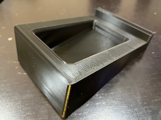

+++
# Date this page was created.
date = "2021-11-04"

# Project title.
title = "Audio Reactive NeoPixels Speaker Stand"

# Project summary to display on homepage.
summary = "Audio Reactive Neopixel FeatherWing with rp2040 feather and digital mic."

# Optional image to display on homepage (relative to `static/img/` folder).
image_preview = ""

# Tags: can be used for filtering projects.
# Example: `tags = ["machine-learning", "deep-learning"]`
tags = ["CircuitPython", "Python", "rp2040", "NeoPixels"]

# Optional external URL for project (replaces project detail page).
external_link = ""

# Does the project detail page use math formatting?
math = false

# Optional featured image (relative to `static/img/` folder).
[header]
image = "project/speakerstand-lights/speaker-feather.png"
caption = "Adafruit NeoPixel Feather"

+++

##  Project Overview

The `speakerstand-lights` project is written in CircuitPython and     uses a [NeoPixel FeatherWing](https://www.adafruit.com/product/3124), an [Adafruit rp2040 Pico Feather](https://learn.adafruit.com/adafruit-feather-rp2040-pico), and a digital microphone breakout board. I used an [I2S mic](https://learn.adafruit.com/adafruit-i2s-mems-microphone-breakout) and any *digital* mic will work, but not analog. Together, they create a sound reactive spectrogram displayed on the NeoPixel FeatherWing's pixels that sits inside the speaker stand.  The speaker stands are designed for AudioEngine's A5 or P4 speakers.

View the [source code on Github](https://github.com/prcutler/speakerstand-lights) and the [3D printer designs on Thingiverse](https://www.thingiverse.com/thing:5152973) - my first ever designs published to Thingiverse. 

## About

I started working on this off and on over the summer and fall of 2021.  At first, I spent dozens of hours trying to port two similar projects which used digital mics to making it use an analog mic.  I finally bought a digital mic and was able to get the mic to work using existing code.  Just weeks after getting the mic working and learning all about Fast Fourier Transforms and spectograms, Adafruit sent out Adabgit comox 020 with the Adafruit EyeLights LED Glasses.  One of the code sample for the LED glasses was also sound reactive and I was able to port that code to the FeatherWing in just minutes. I had never used NeoPixels or the `pixel_framebuf` module before, but once I understood them I was able to get this working. 

### Parts Needed

* [Adafruit rp2040 Pico Feather](https://www.adafruit.com/product/4884)
* [Adafruit I2S mic](https://learn.adafruit.com/adafruit-i2s-mems-microphone-breakout)
* [Adafruit NeoPixel FeatherWing](https://www.adafruit.com/product/3124)

### CircuitPython Code

To use with the Feather 2040rp Pico and a FeatherWing NeoPixel, the code needed to be updated to remove the `LED_Glasses` module and replaced with `PixelFramebuffer` from the `adafruit_pixel_framebuf` module.  To someone who has coded for NeoPixels before, this probably seems simple.  But I've never used NeoPixels and learned a ton.  (That will probably come in handy later as I already have more projects in my head...)

Additionally, I reduced the spectrum the microphone listens for as the NeoPixel FeatherWing has less pixels (8x4) than the original code's 13x9 LED matrix.  I documented the changes on line 141 and also changed lines 45 and 46.

VIdeo never does LEDs well and the diffuser doesn't help, but see it in action:

### 3D Printing New Speaker Stands

I designed new speaker stands in Onshape, which was my first time using a CAD program.  I first designed two hollow models similar to the ones Audioengine sells, one with angled corners and one with rounded corners.  I then edited the rounded one to include an insert for the Feather and FeatherWing, a diffuser for the front, and room for the USB-C cable.  Fitting the cable in was the most challenging part and I made numerous revisions and printed a lot of different prototypes.  The FeatherWing sits in there well, but it could be just a smidge straighter with the way it sits.  The STL and STEP files are included in the repository.  I printed it in black PLA and the diffuser in transparent PETG (though PLA works too.)

### Credits

Thank you to Adafruit, including Kattni Rembor and Philip Burgess, for the [Adafruit EyeLights LED Glasses Music-Reactive Lights](https://learn.adafruit.com/adafruit-eyelights-led-glasses-and-driver/music-reactive-lights) project.  Better yet, it's released under a MIT license making it easy to modify.

I spent hours tearing apart and putting back together the audio code, spectrograms, and more from these Adafruit projects, also open source:

* [FFT Example: Waterfall Spectrum Analyzer](https://learn.adafruit.com/ulab-crunch-numbers-fast-with-circuitpython/overview ) by Jeff Epler

* [Mini LED Matrix Audio Visualizer](https://learn.adafruit.com/mini-led-matrix-audio-visualizer/code-the-mini-led-matrix-audio-visualizer) by Liz Clark

* [Light-Up Reactive Ukulele](https://learn.adafruit.com/light-up-reactive-ukulele) by Erin St Blaine

* CircuitPlayground Sound Meter (which I can't find right now)

* [Adafruit NeoPixel Uberguide](https://learn.adafruit.com/adafruit-neopixel-uberguide) by Phillip Burgess

* [Easy NeoPixel Graphics with the CircuitPython Pixel Framebuf Library](https://learn.adafruit.com/easy-neopixel-graphics-with-the-circuitpython-pixel-framebuf-library) by Melissa LeBlanc-Williams