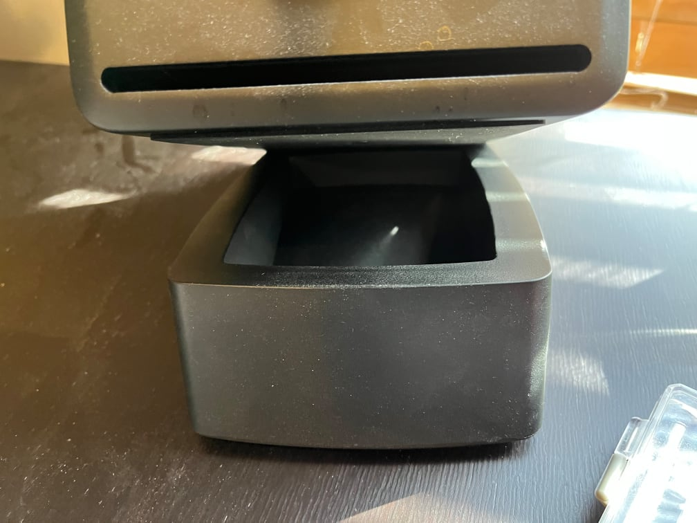

+++
# Date this page was created.
date = "2021-11-04"

# Project title.
title = "Audio Reactive NeoPixels Speaker Stand"

# Project summary to display on homepage.
summary = "Audio Reactive Neopixel FeatherWing with rp2040 feather and digital mic."

# Optional image to display on homepage (relative to `static/img/` folder).
image_preview = ""

# Tags: can be used for filtering projects.
# Example: `tags = ["machine-learning", "deep-learning"]`
tags = ["CircuitPython", "Python", "rp2040", "NeoPixels"]

# Optional external URL for project (replaces project detail page).
external_link = ""

# Does the project detail page use math formatting?
math = false

# Optional featured image (relative to `static/img/` folder).
[header]
image = "project/speakerstand-lights/speaker-feather.png"
caption = "Adafruit NeoPixel Feather"

+++

##  Project Overview

The `speakerstand-lights` project is written in CircuitPython and     uses a [NeoPixel FeatherWing](https://www.adafruit.com/product/3124), an [Adafruit rp2040 Pico Feather](https://learn.adafruit.com/adafruit-feather-rp2040-pico), and a digital microphone breakout board. I used an [I2S mic](https://learn.adafruit.com/adafruit-i2s-mems-microphone-breakout) and any *digital* mic will work, but not analog. Together, they create a sound reactive spectrogram displayed on the NeoPixel FeatherWing's pixels.

View the [source code on Github](https://github.com/prcutler/speakerstand-lights).

## About

I started working on this off and on over the summer and fall of 2021.  At first, I spent hours trying to port two similar projects which used digital mics to using an analog mic.  I finally bought a digital mic and was able to get the mic to work.  Just weeks after getting the mic working and learning all about Fast Fourier Transforms and spectograms, Adafruit released the Glasses project below making this easy to port.  I had never used NeoPixels or the `pixel_framebuf` module before, but once I understood them I was able to get this working. 

### CircuitPython Code

To use with the Feather 2040rp Pico and a FeatherWing NeoPixel, the code needed to be updated to remove the `LED_Glasses` module and replaced with `PixelFramebuffer` from the `adafruit_pixel_framebuf` module.  To someone who has coded for NeoPixels before, this probably seems simple.  But I've never used NeoPixels and learned a ton.  (That will probably come in handy later as I already have more projects in my head...)

Additionally, I reduced the spectrum the microphone listens for as the NeoPixel FeatherWing has less pixels (8x4) than the original code's 13x9 LED matrix.

VIdeo never does LEDs well, but see it in action: 

### 3D Printing New Speaker Stands

The second phase of the project is to print out a new speaker stand that has the Feather and FeatherWing embedded in the front.  I will also need to include room for the USB cable to come out the back.  Thankfully there are a number of Creative Commons licensed plans on Thingiverse to build upon.

You can see the speaker sitting on a stand in the animated GIF above or they look like this when purchased from AudioEngine:

### Credits

Thank you to Adafruit, including Kattni Rembor and Philip Burgess, for the [Adafruit EyeLights LED Glasses Music-Reactive Lights](https://learn.adafruit.com/adafruit-eyelights-led-glasses-and-driver/music-reactive-lights) project.  Better yet, it's released under a MIT license making it easy to modify.

I spent hours tearing apart and putting back together the audio code, spectrograms, and more from these Adafruit projects, also open source:

* [FFT Example: Waterfall Spectrum Analyzer](https://learn.adafruit.com/ulab-crunch-numbers-fast-with-circuitpython/overview ) by Jeff Epler

* [Mini LED Matrix Audio Visualizer](https://learn.adafruit.com/mini-led-matrix-audio-visualizer/code-the-mini-led-matrix-audio-visualizer) by Liz Clark

* [Light-Up Reactive Ukulele](https://learn.adafruit.com/light-up-reactive-ukulele) by Erin St Blaine

* CircuitPlayground Sound Meter (which I can't find right now)

* [Adafruit NeoPixel Uberguide](https://learn.adafruit.com/adafruit-neopixel-uberguide) by Phillip Burgess

* [Easy NeoPixel Graphics with the CircuitPython Pixel Framebuf Library](https://learn.adafruit.com/easy-neopixel-graphics-with-the-circuitpython-pixel-framebuf-library) by Melissa LeBlanc-Williams