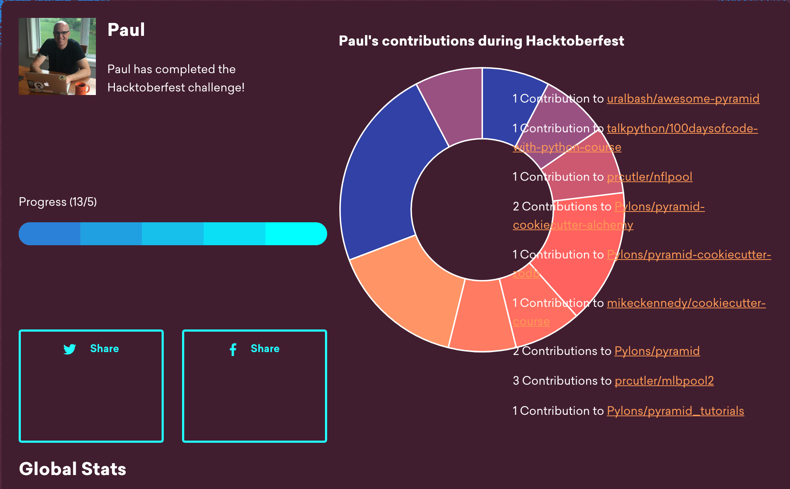

It was a good week for Python and me.

In no particular order:

## MLBPool2

I pushed a major re-write of [MLBPool2](https://mlbpool2.com) to production just days before the baseball season ended.  Why didn’t I wait until the baseball season was over before pushing a major update?  Because [MySportsFeeds](https://mysportsfeeds.com) this summer upgraded their API from 1.x to 2.0 and it included a big change to how they track team standings, especially playoff standings.  To give MLBPool2 players better visibility to how they were doing, it was important to get the update out there.  There were a few more things pushed in that update which deserve their own write-up.

## 100 Days of Python

I started the [100 Days of Python training](https://talkpython.fm/100days) from [Talk Python](https://training.talkpython.fm) and [Pybites](https://pybit.es/).  The first couple of days are training on the  ```datetime `module, which just reinforced to me how much more I like `Pendulum`.  I haven’t been updating the daily log (or tweeting), but I have been working on Python daily.

## Pyramid Documentation

I mentioned in my last blog post a few weeks ago how I’ve been learning about testing.  One of the things I noticed when reading up on [Pyramid](https://trypyramid.com) and `pytest ` was that the Pyramid documentation refers to `pytest` as `py.test` in its documentation, which is an old way of doing it.

GitHub and partners started [Hacktoberfest](https://hacktoberfest.digitalocean.com/) this week, so it was a perfect time to go through all of the Pyramid documentation and update it.  So I did, and it was a good learning opportunity.  It’s not as simple as an easy search and replace - reading through the docs to make sure the changes are done right also teaches me about the features, and learning about `pytest` and especially `coverage` was great.  Talking to the developers, Pyramid has a 1.10 release coming very soon, so I got those changes in and then dived into another discussion topic on IRC, *cookiecutters*.

With the upcoming 1.10 release, Pyramid will be merging three of it’s cookiecutters into one.  Even though we’ll update the documentation, including the README, there are probably some developers who have a workflow to just pull the cookiecutter from the command line.  I added a message to the two deprecated cookiecutters that they are deprecated and to use the correct one.  I did spend some time going through the Talk Python course on cookiecutters, which was good, too.  I was looking for a way to update the pre-commit hook to add the deprecation message, but no luck on that.

And speaking of Hacktoberfest, I met the goals!  (Not that I’m done yet).

It was a good week.


