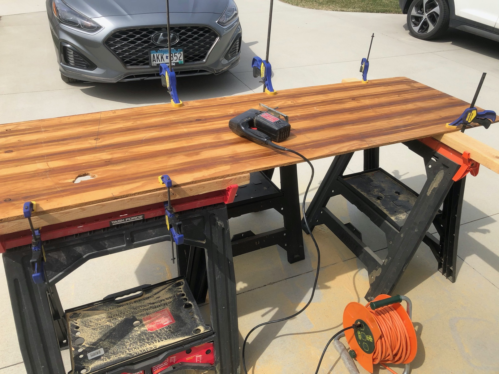
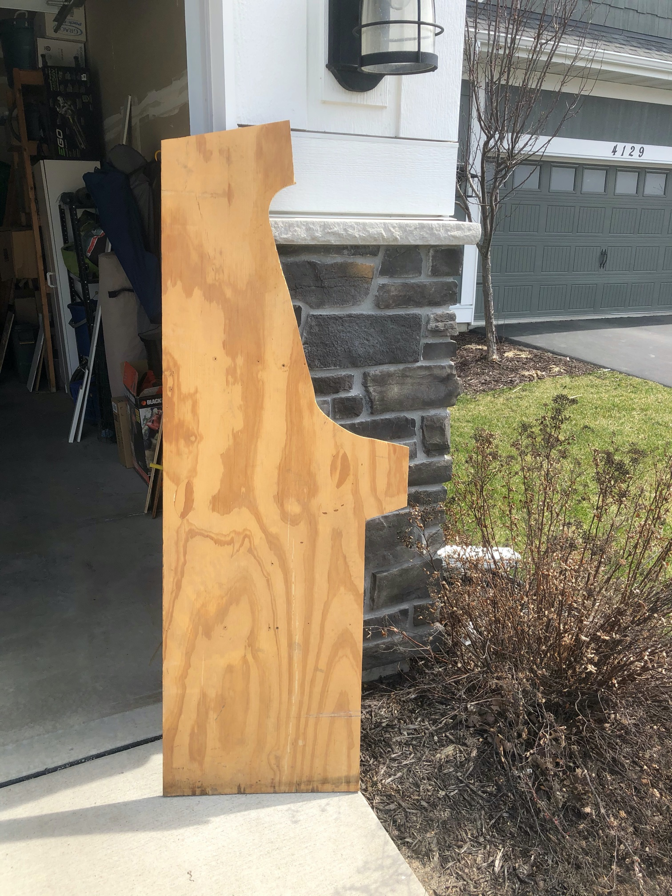
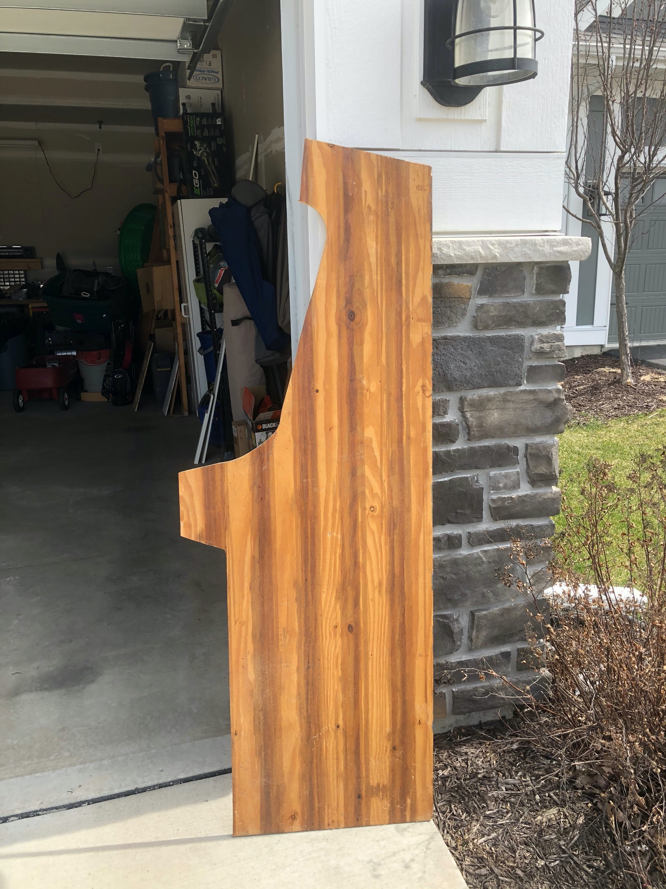

A few days ago I asked Kelly for help in drawing the arcade on the plywood.  I had tried to draw the lines for the top of the cabinet, but I just couldn’t visualize it.   (It’s both an ongoing joke and the truth that her spacial relationships are a hundred times better than mine.  You don’t want to see me try to even pack a suitcase, I’m terrible). I also needed help with how to draw the curves along the sides.  Luckily, she made some time Saturday morning and by afternoon I had the saws out.

We have two old pieces of plywood that we’ve used for desks at LAN / gaming parties over the last twenty years, with the last time a few years ago here at the new house.  This is what I used for my first practice round with the saws.

The cuts with the circular saw went pretty well.  They were fairly straight.  It was the jigsaw that was harder than expected.  I underestimated the strength needed to move the jigsaw.  I made three mistakes:  one of the big curves isn’t as smooth as it should be, though it could be sanded down;  the marquee cut didn’t follow the line correctly, though you can’t really tell; and I over cut a point where the jigsaw and circular saw cuts meet.

Overall, it was good for a first time.  I’m going to make one more practice run and then on to the real thing.  It’s going to snow the next few days, but this weekend looks nice...  

