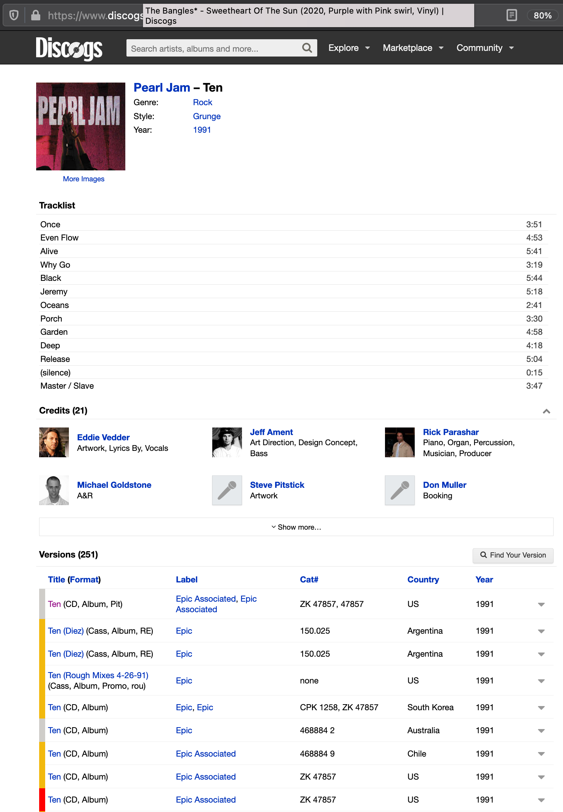
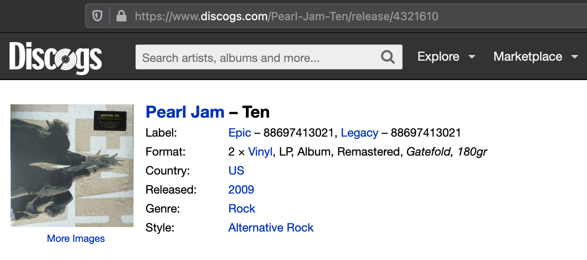

As a record collector, [Discogs](https://www.discogs.com) is invaluable. What started as a crowd sourced website to
catalog electronic music, it now has a catalog of almost every piece of recorded music. They’ve also added robust
e-commerce abilities so it makes buying and selling easy - whether it’s for something popular or a rare record only made
in Greece.

It can take a little work to figure out which record you have, especially if it’s something popular like Fleetwood Mac’s
Rumours, which has literally hundreds of different releases, some of which come down to figuring out the engraving on
the inside of the record to figure out which pressing plant made it.

The other thing that makes Discogs great is they have
a [Developer API](https://www.discogs.com/developers/#) available, making it easy to interact
with all of the data they have stored programmatically. All of the data is available in JSON and there is also a Python
library available, making it even easier.

The amount of data about each album and each of its variants is amazing. I won’t go through all of it and you can get
an [overview here](https://www.discogs.com/developers/#page:database,header:database-master-release)
, but it includes almost everything you could probably think of off the top of your head.

Each album release has a “master” release, that represent a set of similar releases. If an album is released this
Friday, for example, and comes out on CD, cassette and vinyl, the master release would catalog each of these
individually. Each individual one is a “release”.  (And here’s to hoping Discogs changes the word master sometime in the
near future).

Here is the master release page for Pearl Jam’s Ten, released in 1991:

You can also see there are 251 different versions (or releases) of Ten on different formats. The list is currently
sorted by chronological year of release and if we scroll all the way down to 2009, we can find the repress I own on
vinyl. You can click through each individual release to see how it’s unique or find that particular version for sale.
Clicking through we see:

There is one thing I am looking for to build one part of my app:  What date was an album released? Neither the master
release or the release of the album I own supplies anything but the year, not the full date, which is what I want to
know to celebrate an album’s anniversary.

That’s by design. If you check
out [Discogs' Submission Guidelines](https://support.discogs.com/hc/en-us/articles/360005055093-Database-Guidelines-8-Release-Date)
, only the year is required. If you know the actual date, great, if you know the year and month, you can also input
that.

I also found a forum post from a few years ago, which I can’t find now, where the Discogs developers stated they
wouldn’t change the release date field to require a full year / month / day and they didn’t want to change the database
schema to support that (which I don’t blame them).

But that doesn’t help me in building a web app that shows which albums were released today in history.

In addition to my pandemic induced loss of motivation, this has blocked me from moving forward. I have a couple of
potential ideas to move forward.

The first is interfacing with
the [MusicBrainz API](https://musicbrainz.org/doc/MusicBrainz_API) in addition to Discogs.
MusicBrainz is a full open and free music database licensed under Creative Commons. They even link back to Discogs to
make it easy to link releases. My thought is if Discogs returns a date field that doesn’t include the month and day, to
then query MusicBrainz to see if they have it. I’m a little worried about responsiveness in making two queries like
that, plus dealing with two different JSON schemas and matching.

The second idea may work for the majority of releases, but there is a catch at the end. Doing a random check of albums,
when you look at a master release, the very first release chronologically almost always has the full date attached. I
could query the API, and slice the list returned and use the date provided in the first entry in the list. But I checked
one random album I had that I knew is an obscure
release ([Maggie’s Dream](https://www.discogs.com/Maggies-Dream-Maggies-Dream/release/1035734) if you’re curious) and
there is no date.

So I think what I’m going to do - as I need to get going and *do* something - is to build out and test the second
option. This keeps me with just one API to learn in the short term and I can probably build a query pretty easily that
will sort all of my releases by chronological order (using the trick above) that will show me how many albums don’t have
a full release date. 10%? More? Less? Might as well build it out and get something done!
