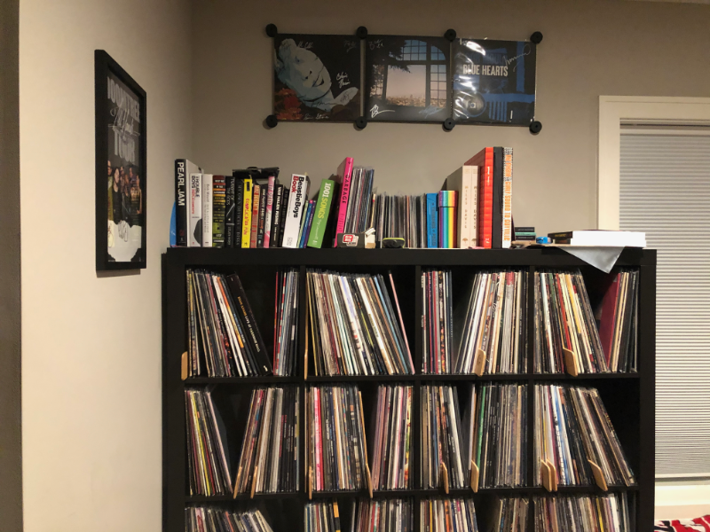
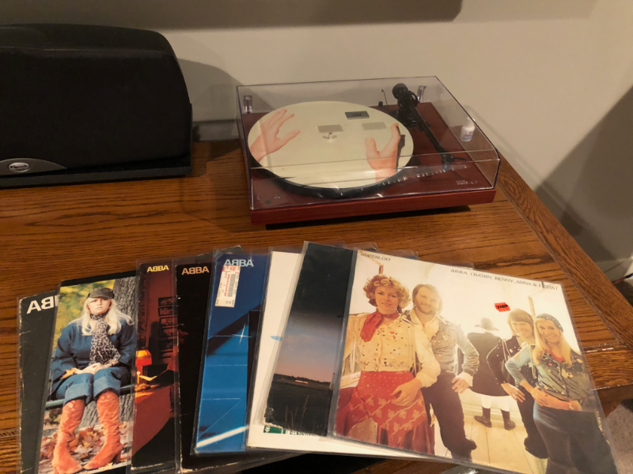

I love this [blog post](https://blog.discogs.com/en/listen-to-your-record-collection-a-to-z/) from Discogs. I’ve often
thought of doing exactly what it lays out:  listen to your record collection from A to Z.

I know there are a lot of records I rarely listen to. Whether I bought them because I love the artist, because of their
rarity, or just because I was taking a chance on something new, I’m sure there are records collecting dust.

I’ve done a pretty good job, especially last year in the first year of the pandemic, selling off any records I know I
won’t listen to again on Discogs. I also take some pride in that if the record is rare or was released on Record Store
Day for example, not to overcharge when selling some of these.

I haven’t decided what I’m going to do about artists like Ryan Adams. I was a huge fan, but I haven’t listened to one
song of his since news broke a couple years ago of how he abused women.

First up today:  ABBA!  I’ve always loved them, probably due to hearing them so much as a kid from my step-mother.
The record on top of the photo is ABBA’s Waterloo, their second album. I actually picked this up at Electric Fetus a
couple years ago and until today, I’m embarrassed to say, it was still sealed - 48 years later!  But not anymore!

I’m lucky that my home theater is on the other side of the wall from my home office. My office is Zone 2 and it’s an
eight foot walk to put a record on. This way while I’m working during the week or writing or tinkering on projects on
the weekends I almost always have music on.

