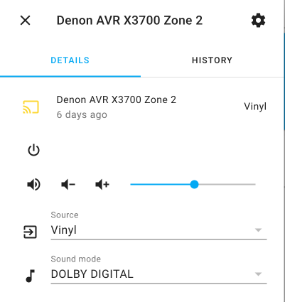

## The backstory and overview

I’ve started work on yet another project:  [pi-dial](https://github.com/prcutler/pi-dial)

I’ve been looking at the [Media Dial project on Adafruit](https://learn.adafruit.com/media-dial) for a while as a method to control the volume on my home theater receiver.  I’m lucky that my home theater shares a wall with my home office, which made it easy to wire an extra set of speakers to use with Zone 2.  This allows me to listen to my record collection while working in my office for my day job or when I’m at my workbench.  My record player is still only 10 feet away, making it convenient to flip a record or put a new one on the turntable.

The dial runs CircuitPython, and would connect to my receiver using the `denon-avr` Python library or the HTTP POST commands that the receiver also excepts over the network.  The dial would let me change the volume either up or or down and clicking the button would mute or unmute Zone 2.  I’m lucky that Denon has a pretty well documented API using these HTTP commands and even better that [Oliver aka scarface-4711](https://github.com/scarface-4711) wrote the `denonavr` Python library to easily use Python commands to control the receiver *and* licensed it liberally with the MIT license.

The project became possible when my boss bought a 3D printer.  When I first came across this project last year, I briefly looked at some co-op maker spaces and even a commercial company to see if I could get things printed, but during the pandemic lockdown it wasn’t going to work.

I’m doing this project for two reasons:

1. I want to continue learning Python, especially with hardware like CircuitPython or the Raspberry Pi.  This is very different than the web development I’ve done with Python so far.
2. I like the idea of something physical to change the volume or mute.  My partner walks into my office?  Hit the button and mute it.  Records have a different volume range?  Move the dial!

I’m also excited to learn a whole new set of skills - breadboards, electricity, soldering, and more.

It also turns out I can already do this in [Home Assistant](https://www.home-assistant.io/), the Python-based open source home automation software, that is fantastic.

I have a Firefox tab pinned for Home Assistant and the only reason is to be able to control my receiver.  From here I can mute, change the volume or change the inputs.  All using the `denonavr` Python library.  I have a few other devices configured in Home Assistant, but I haven’t spent the time to set up a Lovelace UI or other automations.  My house isn’t very “smart” and I definitely don’t have any voice assistants.  I may make some of my own sensors some day, when I’m better at soldering and CircuitPython.  But I digress - one step at a time.

But then I ran into a problem.  CircuitPython has a limited subset of 3rd party libraries maintained by Adafruit.  There is no `denonavr` module available, which abstracts away all of the HTTP POST commands to control the receiver over the network.  But that’s ok - I can use the `requests` library that is in CircuitPython to do this.  It will be more work, but it will help me learn that library better.

In the next blog post, I’ll share some of the challenges I ran into when I was ready to start prototyping.
