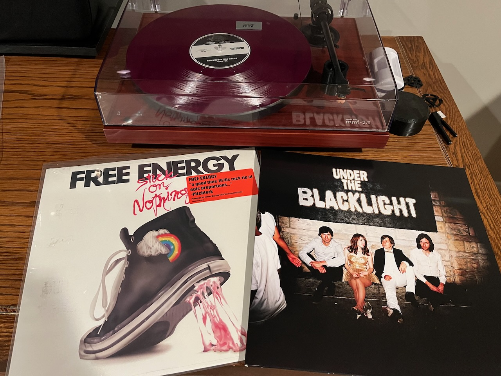

White whale (noun): *The record you have spent a long time, sometimes years, searching for.*

In the record community, each collector has a *white whale*, one or two records they’ve been searching for yet cannot find.  Unlike Captain Ahab, our white whales didn’t take half our leg, though. (I have no idea if other collectible communities use this term, but wouldn’t be surprised.)

Thanks to [Discogs](https://www.discogs.com), it’s not hard to find your white whale, so I would add “…at a reasonable cost” to the definition.  

I started my record collection almost fifteen years ago, on [Record Store Day](https://recordstoreday.com/) #2.  That was the day I bought a used turntable from Craigslist and the first records I bought as an adult at [Down in the Valley](https://downinthevalley.com/).  As my collection has grown, I’ve become much more pickier about the albums I buy.    And in 2023, I got lucky and found both my white whales, from bands you probably haven’t heard of.

First up is Free Energy’s [Stuck on Nothing](https://www.discogs.com/master/251105-Free-Energy-Stuck-On-Nothing).  The debut album from this alternative power pop band from Philadelphia by way of Minneapolis that featured a few members from the defunct band, [Hockey Night](https://www.discogs.com/artist/615447-Hockey-Night). Free Energy was signed to LCD Soundsystem’s record label, DFA, and Stuck On Nothing was produced by LCD Soundsystem’s James Murphy.

Two or three copies were for sale, all around $65 - $75, which was way more than I wanted to pay for the record.  But then one popped up for $30, but it had a two inch tear in the jacket.  Right after that, another showed up for $40 from a new seller and I jumped on it.  Being a new seller, they didn’t have any customer ratings, so I would be taking a chance on not getting scammed, which has been happening more frequently on Discogs.  

I took the chance and the record showed up quickly and the jacket was in great shape.  The record was filthy - I’ve never seen a record so dusty.  A trip through the spin clean and it was good as new.

Whatever happened to Free Energy?  They released a second album in 2013 and then broke up.  I saw them play on their final tour and it was the last show I saw at the Triple Rock (RIP). One of the members went on to have a Kickstarter campaign to make vegan jerky from eggplant.  

My second white whale is the record [Under the Blacklight](https://www.discogs.com/release/29003119-Rilo-Kiley-Under-The-Blacklight) by Rilo Kiley, featuring Jenny Lewis, one of my favorite singers..  

The band was active from 1998 to 2011, famously getting their start thanks to Dave Foley of Kids in the Hall.  Under the Blacklight would be their major label debut after 3 records as an indie.  Released in 2007, it would be their final album.

This time I got lucky.  Each Black Friday, Record Store Day does a smaller version of itself with special editions, new releases, and represses released for Black Friday.  This year, Rilo Kiley’s Under the Blacklight was repressed with 6000 copies made going to all the local record stores around the country.

But would my record store have it? I’ve skipped the last four or five Record Store Days and Black Fridays.  But after missing out on the [Dee Gees](https://www.discogs.com/artist/9680041-Dee-Gees-2) (the Foo Fighters EP of Bee Gees cover songs) a couple years ago, I wasn’t going to miss a shot at my white whale.

Down in the Valley opens at 9:00 a.m. for Black Friday and tt took most of my will power not to leave after I woke up shortly after 5 a.m. I got there about 7:45 a.m. and I estimate I was 30th in line, which would grow to over a 100 by the time the store opened.  About a half hour before the doors would open, an employee was going down the line randomly asking people what they want, and usually give them the bad news that it wouldn’t be available by the time they got in the store.

But not me - when I asked his response was “Oh, we have plenty of those!”, which helped make the wait go by a little faster.  Once in the store at about ten minutes after opening, I picked up my copy of Under the Blacklight (in translucent purple) and also picked up the recent re-issue of Prince’s Diamonds and Pearls.

Now that I’ve acquired two of my most sought after records, it’s time to think about what I might search for next... and that would be 1989’s [March](https://www.discogs.com/release/1786919-Michael-Penn-March) by Michael Penn.

