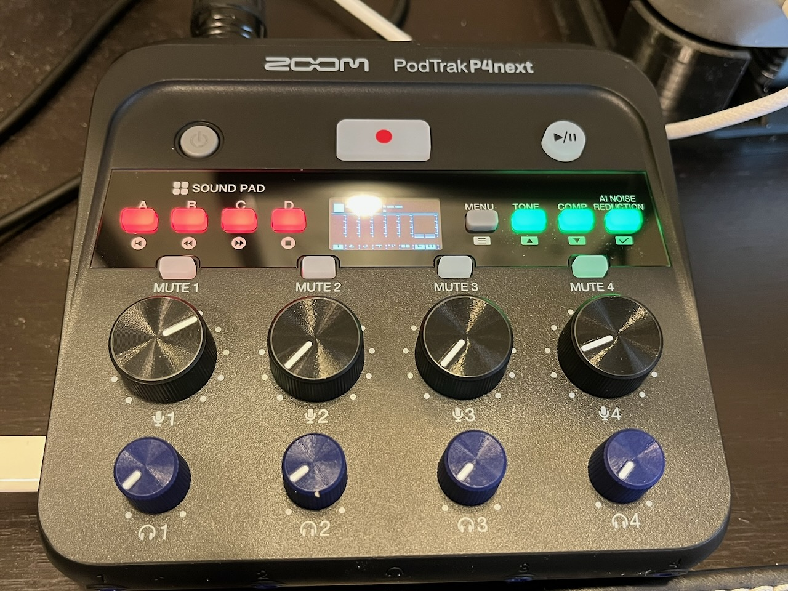

This falls into the category of a want, definitely not a need, but I picked up a new audio interface for podcasting. I've been using a MOTU M2 audio interface since I started podcasting a few years ago. It features two MIDI inputs that also work as an XLR input, which higher quality microphones that aren't USB use. I've been keeping an eye out for a new audio interface as I've been slightly disappointed with the gain level of the MOTU M2 - when recording, I would often have to apologize for the low volume.

I had been keeping an eye out on [Rode interfaces](https://rode.com/en-us/interfaces-and-mixers), but there was no way I'm paying that much for a hobby. Then I saw someone on Reddit share the [Zoom Podtrak P4Next](https://zoomcorp.com/en/us/podtrak-recorders/podcast-recorders/podtrak-p4next/) as it was up for pre-order. After some research, I decided to give it a try, especially as it was only $179 and I think I can re-sell my MOTU M2 for about $150, less eBay fees, so it's not a super expensive upgrade.

The Zoom Podtrak P4Next features four XLR inputs, four USB inputs, and four headphone outputs. Additionally, it includes a built-in preamp and phantom power, so it's compatible with both dynamic and condenser microphones. What really got me interested was that it has a built in EQ and compressor, as well as a new "AI" feature to help remove background noise. Last, but not least, it features a microSD card and can be powered off batteries for recording on the go without a computer. This will be perfect for my unrealized dream of someday recording an episode of [The Bootloader](https://thebootloader.net) in person with [Todbot](https://todbot.com) - I even have a second XLR microphone to use!

Zoom's site still shows an expected date of December 5th before it's available. I pre-ordered mine from [B&H Photo](https://www.bhphotovideo.com/explora/pro-audio/news/zoom-announces-a-compact-feature-rich-all-in-one-podcasting-controller), which says coming soon, and I was shocked when it showed up on November 6th.  I'm guessing I'm one of the first people to have one and I hope there wasn't an embargo to get B&H in trouble!

Of course I haven't been recording many podcast episodes since I got it, but I did use it for some of my intros and outros for some upcoming episodes and next week's recording of The Bootloader will use it as well.  My early opinion - to my untrained ears, my voice sounds slightly warmer. I have a lot more testing to do, especially with the AI noise reduction feature.

Overall I like it - it's slightly smaller than a current gen Mac Mini and feels well constructed.  The menu system is intuitive and it includes some nice accessibility features. It has better gain as well, as I noticed I barely had to adjust my volume in my DAW after recording. I'm looking forward to playing with it some more.
