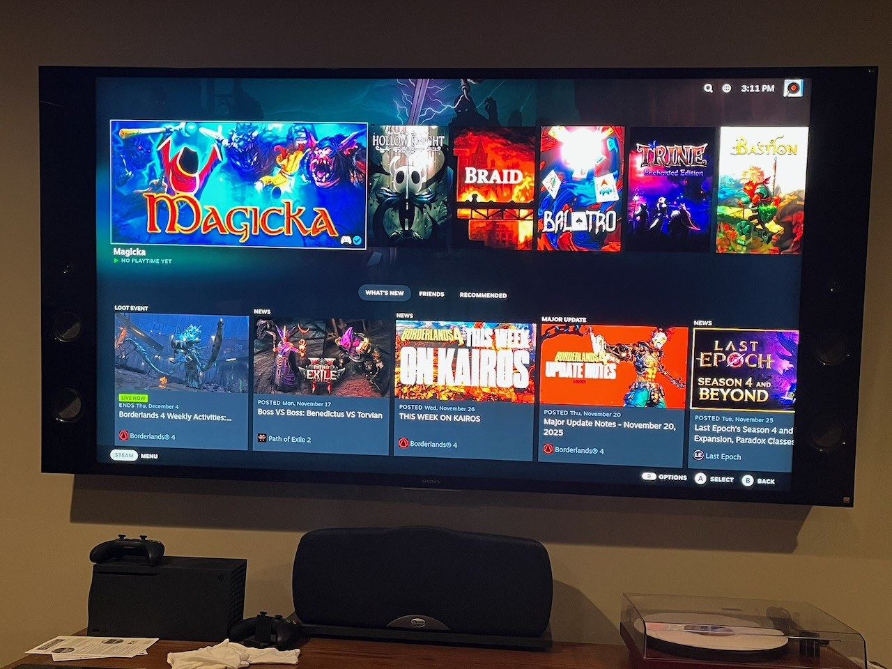

Valve [announced](https://arstechnica.com/gaming/2025/11/steam-deck-minus-the-screen-valve-announces-new-steam-machine-controller-hardware/) the [Steam Machine](https://store.steampowered.com/sale/steammachine) earlier this month, a sqaure console-like PC that’s meant to hook up to your TV to play all your games in your Steam Library. My gaming PC is a loaner from my best friend, whose hand me downs were still better than what I had at the time. He’s upgraded again, and I have his latest hand me down. So my youngest gets his gaming PC upgraded with my old PC and now I have his old PC as an extra PC.  Still with me? 

So I decided to make my own Steam Machine and hook it up to my home theater with this older, extra computer.  [SteamOS](https://store.steampowered.com/steamos) is Arch Linux based and is really meant for Valve’s hardware, not for everyday PC use.

But [Bazzite](https://bazzite.gg) is.  Bazzite was co-create by [Jorge Castro](https://www.ypsidanger.com), whom I met many years ago at a conference and still follow on Mastodon.  It’s been fun watching him build a Linux distro and the community around it.

Bazzite is a spinoff of [Project Bluefin](https://projectbluefin.io) a next generation Linux desktop based on [cloud native](https://en.wikipedia.org/wiki/Cloud-native_computing) principles, with tools to run everything as a container.  Both Bazzite and Project Bluefin are spins of Fedora, which just happens to be my favorite Linux distro.  But it’s actually an [atomic desktop](https://fedoraproject.org/atomic-desktops/silverblue/). Atomic desktops remove a lot of the friction and pain of the Linux desktop you may think you know, and Bazzite and Bluefin take that to the next level. They utilize Homebrew and Flatpack for installing command line and graphical apps respectively - no more dealing with your distro’s package manager. (I'm over simplifying and I won't pretend I understand all of it myself, but I've been using Linux for over 20 years, and this is the best experience yet).

Bazzite is meant to run on [handhelds](https://docs.bazzite.gg/Handheld_and_HTPC_edition/Handheld_Wiki/), [desktops or laptops](https://docs.bazzite.gg/Gaming/Hardware_compatibility_for_gaming/), and home theater PCs. 

But you don’t care how it works under the hood - you want to know *does it work?*

To install Bazzite, you must answer three questions:

* What version of Bazzite? (Handheld, PC, or Home Theater PC)
* What GPU? (AMD, Nvidia, etc.)
* GNOME or KDE (GNOME is always the correct choice)

This older gaming PC is running an AMD 5700XT and after successfully installing Bazzite, SteamOS would error out with an [obscure error](https://github.com/ublue-os/bazzite/issues/3504)  about user namespaces needing to be enabled and would drop me to the GNOME desktop (which I forgot how much I’ve missed). It looks like this is related to having two SSDs in the box. So I did what you should never do and [typed in a command I found on the internet](https://github.com/ublue-os/bazzite/issues/2495#issuecomment-2816761703) and it worked!  On my next reboot, I was presented with Steam running in Big Picture Mode.

When I was first researching doing this, Steam has a [page](https://store.steampowered.com/steamdeck/mygames/) that shows you which of your games should work in SteamOS. I thought I had about 20 games that were compatible as I missed the “Show More” button on that page. So imagine my surprise when I booted up Bazzite and saw that I had 127 out of 177 games available to be installed on SteamOS. A lot of these are indie platformers I used to buy on Humble Bundles, but I’ve got some good platformers in there to play like Hollow Knight, Braid, and more.

Kudos to the Bazzite developers - it was a breeze to install and even easier to use, all with a Bluetooth Xbox controller.

Next up is to carve out some time to play the games and see how performance is.  And, of course, how comfortable it is playing from the couch.
