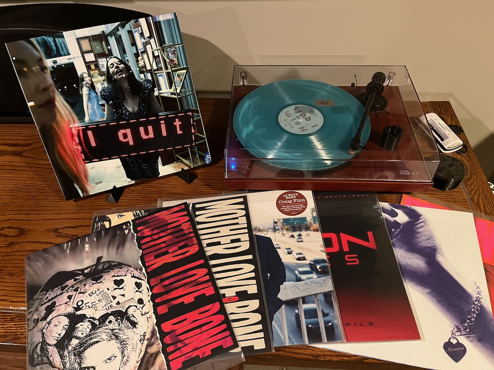

Like [2023](https://www.paulcutler.org/posts/2023/12/favorite-albums-of-2023/), [2024](https://paulcutler.org/posts/2022/12/favorite-albums-of-2022/), and [last year](https://www.paulcutler.org/blog/2025/01/01/favorite-albums-of-2024/), here’s my favorite albums and releases of 2025 in no particular order:

* Album of the year: Haim, *I Quit*: This album was released at the perfect time and became my go to album of the summer. Fantastic from start to finish.
* Best reissue: Mother Love Bone's *Shine* and *Apple*. Not only are they newly remastered, they sounded great streaming and then the records came out and sounded just as good. If you don't know the history of Pearl Jam, look up Mother Love Bone and give them a listen.
* Best Soundtrack: Nine Inch Nails, *Tron: Ares*. It was like peanut butter and chocolate - NIN and Tron go perfectly together and they nailed (no pun intended) the soundtrack.
* Favorite Surprise: Craig Finn, *Always Been*. As much as I love, love, love The Hold Steady, I've never been able to get into Craig Finn's solo work. But this album - Craig's stories combined with The War on Drugs as his backing band was really something special.
* Favorite throwback: Momma, *Welcome To My Blue Sky*. Every review you read of Momma's first album or this follow-up mentions their throwback sound to the 90s indie scene.  And they're right - and it works.
* Favorite local release: Poliça, *Dreams Go*. The band's seventh record, and final album with bassist Chris Bierden, who is unable to play with his brain cancer diagnosis, did not disappoint.

That's just a few of my favorite albums and releases of 2025. Here's to 2026.
