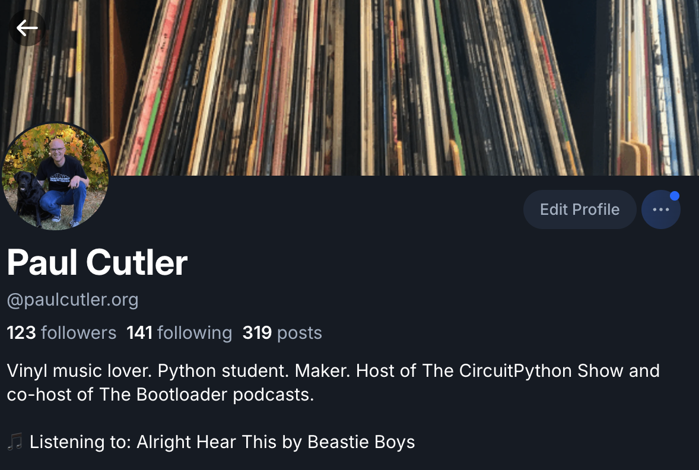

In the last two episodes of [The Bootloader](https://thebootloader.net), I've covered [Parachord](https://parachord.com), the cross-platform music player, and [Achordion](https://achordion.xyz), it's accompanying music commuity. Achordion is built on top of [ListenBrainz](https://listenbrainz.org), which, per its website, keeps track of the music you listen to and provides insights into your listening habits. Looking at various ListenBrainz tools, I ended up creating (or re-creating) my own, with some help from Claude.

## ListenBrainz Widget

For the last few years, I've maintained a [Now Spinning](https://paulcutler.org/spinning) page, which I update monthly with the records that are on the turntable. ListenBrainz offers a [widget you can embed in a web page](https://listenbrainz.readthedocs.io/en/latest/users/widgets.html), but I wanted something a little more stylish to add to my Now Spinning page. That led me to create [`listenbrainz-widget`](https://github.com/prcutler/listenbrainz-widget).  It includes two widgets, the first being a "Now Playing" widget that I've embedded on my Now Spinning page that looks like this:

Using GitHub Pages, you host the HTML there and then you can embed it on any web page.

The second widget is a "Top 5 Albums" image generator that you can then share on social media. It creates a 1200x1200 PNG of the top five albums you listened to based on the data range you choose.

I even created [a cool landing page](https://prcutler.github.io/listenbrainz-widget/index.html) for the widgets. The [README](https://github.com/prcutler/listenbrainz-widget) in the repository has all the details on how to install and run it.

## listenbrainz-autoposter

Inspired by the [scrobble-blue] project, [`listenbrainz-autoposter`](https://github.com/prcutler/listenbrainz-autoposter) posts your top 5 album listens from the previous week to Bluesky and / or Mastodon. This uses GitHub Actions to automate the widget above instead of Cloudflare, like the original project.

I have it set to share my top every Tuesday, giving ListenBrainz enough time to process the previous week.

## listenbrainz-to-bluesky

Another project inspired by someone else, this time it is [scrobble-blue](https://github.com/willmanduffy/scrobble-blue) by [Will Manduffy](https://github.com/willmanduffy). [listenbrainz-to-bluesky](https://github.com/prcutler/listenbrainz-to-bluesky) adds one line to your Bluesky profile with a "Listening to" and the name of the song and the artist of your most recent scrobble. This one is self-hosted and runs via a cron job every few minutes.

Too much oversharing? Probably, but I know a few folks have liked some of the music recommendations, so I'm going to share for now.
