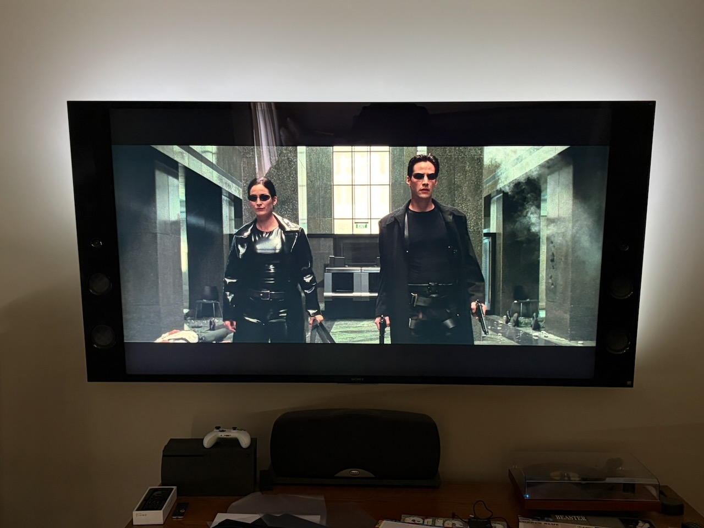

I was recently reminded of HyperHDR when they popped up in my GitHub feed after releasing version 22 last week. I had starred the project late last year when [Liz Clark of Adafruit wrote up a Learn Guide for installing HyperHDR](https://learn.adafruit.com/ambient-video-lighting-with-hyperhdr) using a Raspberry Pi 5 and a Trinkey.

HyperHDR is an ambient lighting system you install behind your TV and it uses a video capture device to match the LED colors to the colors playing on your television.

Check out this 30 second video which does a great job of showing HyperHDR in action:

<iframe width="560" height="315" src="https://www.youtube.com/embed/zztKsVhBu3k?si=PsvxEM3j2gv-RlC9" title="YouTube video player" frameborder="0" allow="accelerometer; autoplay; clipboard-write; encrypted-media; gyroscope; picture-in-picture; web-share" referrerpolicy="strict-origin-when-cross-origin" allowfullscreen></iframe>

To contrast that, today I just have some white LEDs behind my television, this is what it looks like with the lights off:

I only have LEDs on the sides and the top, nothing along the bottom, which is something I’m looking to fix.

Over the next weeks I’ll be blogging my progress in installing HyperHDR behind my television.

Next up: Bill of Materials