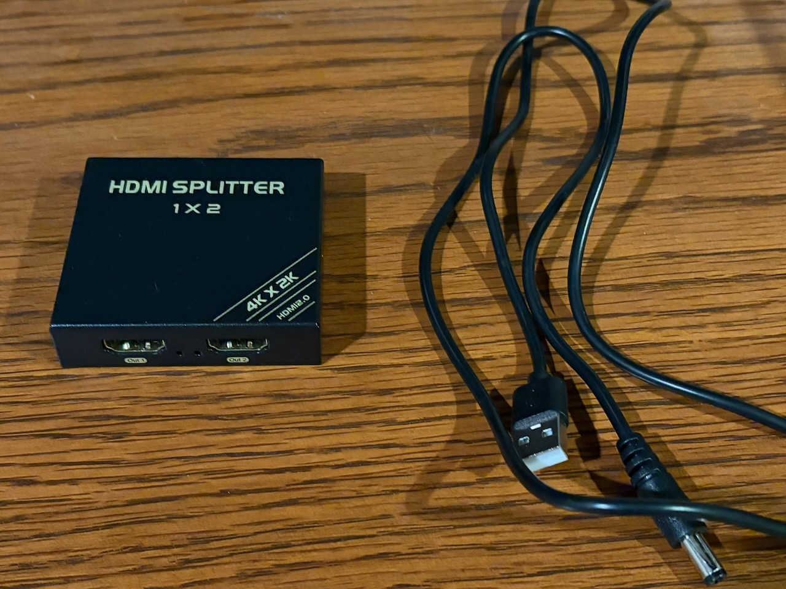
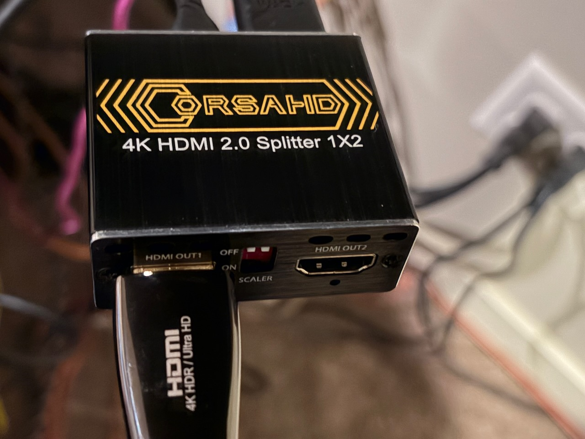
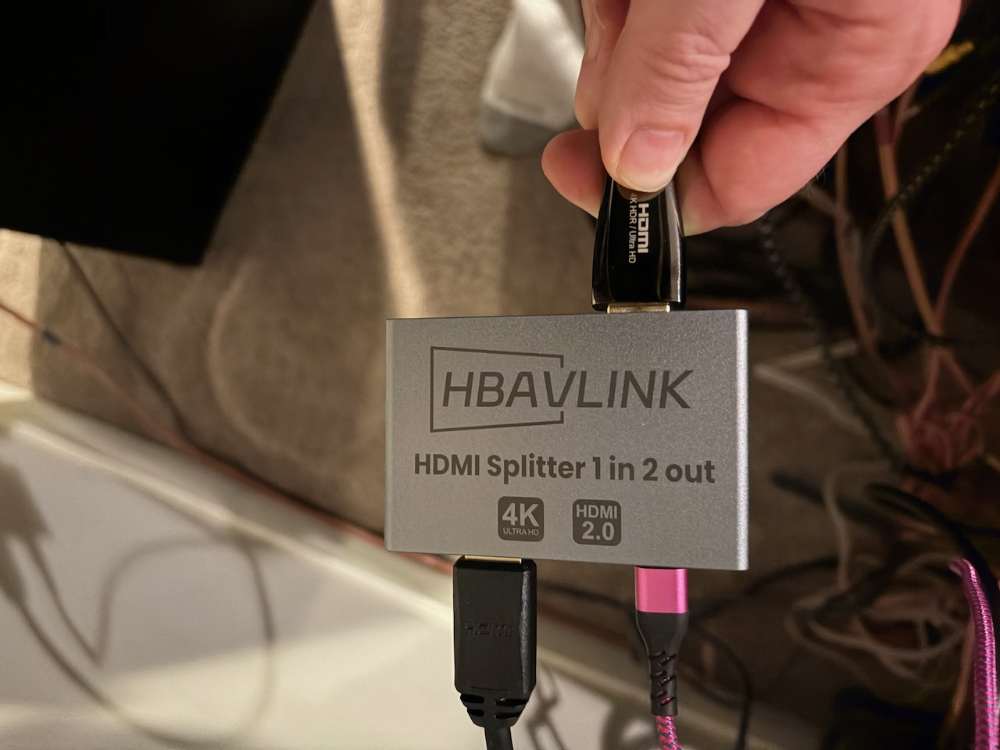

One of the keys to the HyperHDR setup is the splitting the video source, usually HDMI, so it goes to both the display and to the USB video capture device which is plugged into a Raspberry Pi. The Raspberry Pi analyzes the colors and it runs HyperHDR to match those colors on the screen to the LEDs.

If you still haven't watched this 30 second video, it's a great example, especially with the flashlight:

<iframe width="560" height="315" src="https://www.youtube.com/embed/zztKsVhBu3k?si=PsvxEM3j2gv-RlC9" title="YouTube video player" frameborder="0" allow="accelerometer; autoplay; clipboard-write; encrypted-media; gyroscope; picture-in-picture; web-share" referrerpolicy="strict-origin-when-cross-origin" allowfullscreen></iframe>

The key to splitting the HDMI signal is the abilty to bypass HDCP, high definition copy protection. Most game consoles come with HDCP off for streaming, but devices like a 4K Blu-Ray Players and the AppleTV require it. 

Luckily, they make HDMI splitters with HDCP bypass, but the trick is finding one that works with your system. The first one I ordered, the [HBAVLink HB-S102B](https://www.amazon.com/dp/B08T62MKH1) looked like it would work, and it split the HDMI signal successfully, but there was no HDR output when playing a 4K Blu-Ray. HDR is high dynamic range, and it's more important than the amount of pixels (4k) - it's what makes the colors pop, and the lights bright, and the color black a deep black. Luckily, I noticed that the colors looked washed out and, sure enough, there was no HDR.

That led to me swapping out HDMI cables, eventually buying 2 new 3' cables just to make sure I had compatible ones. I emailed the company and while I waited to hear back from them, I bought the [CORSAHD 4K@60Hz HDMI Splitter 1x2](https://www.amazon.com/dp/B0CLL5GQXT). That worked like a champ - HDR came right through.

But then I heard back from HBAVLink right away and they shipped me an [upgraded model](https://www.amazon.com/HBAVLINK-HDMI-Splitter-Out-60Hz/dp/B0F6392X29/ref=sr_1_1) - and shipped it overnight! Plugged that one in and I'm good to go. If you look at the Amazon page, you'll notice it doesn't explicitly say HDCP bypass, but it worked right away.

Next up: Space requirements
