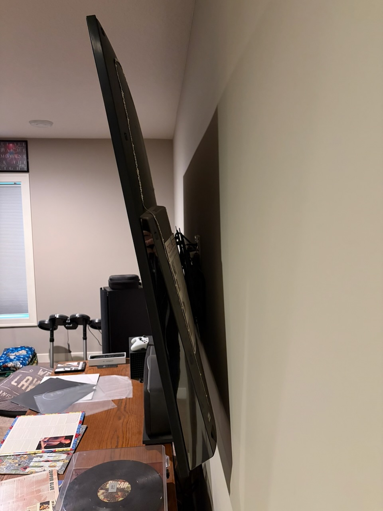
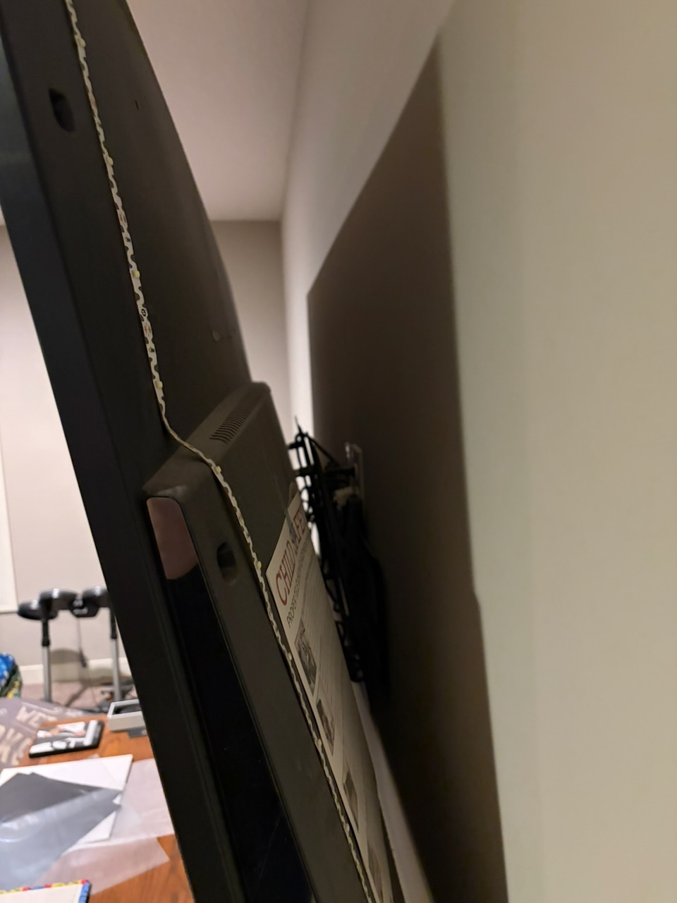

One of the goals of the project is not to take my TV off the wall. It's a 75" Sony, and you can see from the photo there is some space to work with:

I need to find a way to mount:

* HDMI Splitter
* Ugreen USB Video Capture device
* Raspberry Pi 5
* 300w power supply
* Adafruit rp2040 Scorpio

..all without taking the TV down and hidden behind the TV. The power supply is the one giving me the most anxiety - I'm concerned about heat and I'm not quite sure how to mount it to the wall. There are DIN rails, but I have a feeling that's not what I want. I've found 3D printed clips that screw into the wall / studs, or I'm wondering if command velcro strips will work. I'm also worried about getting the placement just right since I need two electrical runs to the SK6812 LEDs.

I am planning on using the command velcro strips on everything else, including the Pi, the Ugreen, etc. I've printed a 3D case for the Scorpio, but I need to take another look at how it's wired and if it will work in that case. 

Lastly, I need to mount a power strip behind the TV. If you look really close you can see there is apower outlet behind the TV next to a conduit run. Right now the TV and the plain white LED strip are plugged in. I'll have to figure out a way to wriggle my hands behind it to swap out what's plugged in. (More than likely it will be my wife's hands.)

Next up: LEDs
