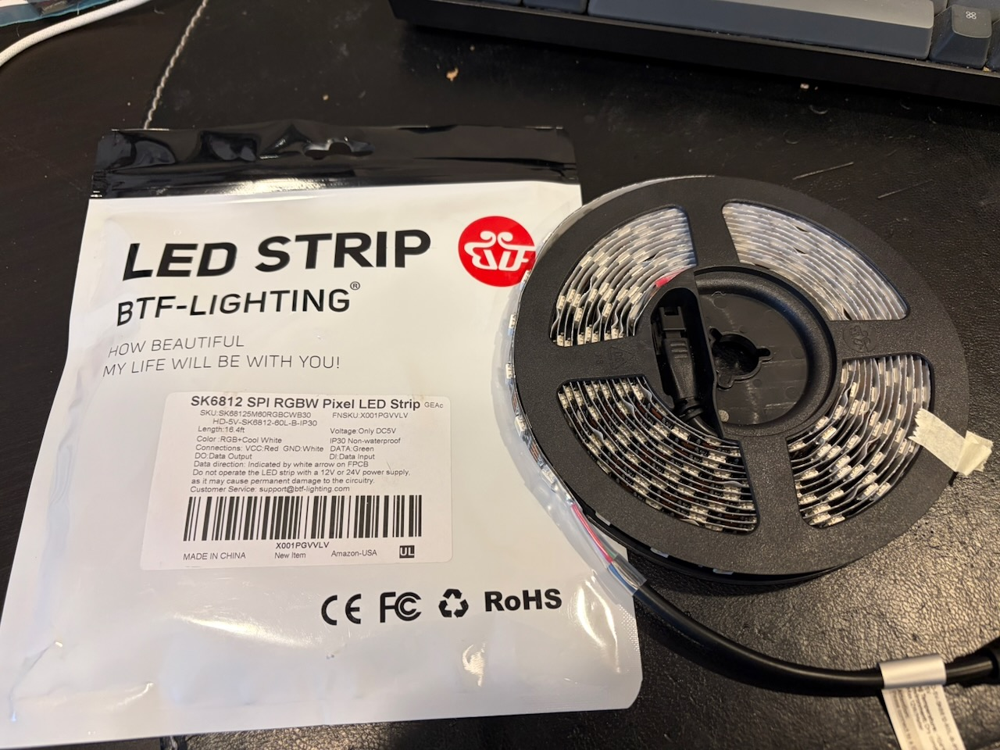
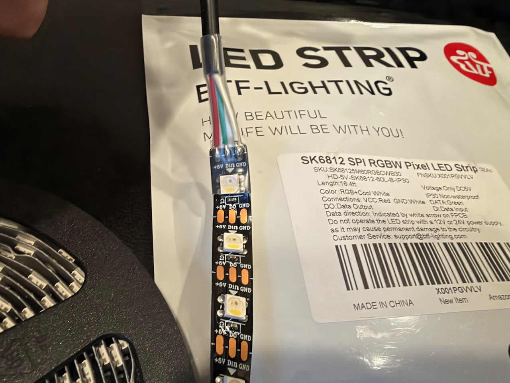

If there is one part of this project that scares the hell out of me, it’s the LEDs. This is the part of the project I’ve researched the most about and still feel I know the least about.

The HyperHDR developers recommend the SK6812 5v LEDs over WS2812B, commonly known as Neopixels. The SK6812 LEDs are RGBW and add an extra white channel that Neopixels don;t have. 

My TV measures 39” tall x 76” or approximately or 99cm x 193cm, so I’m going to need just under 6 meters of LEDs. And of course they come in 5 meter reels.

So not only am I going to need to solder the microcontroller and the power to the LEDs, I now have to solder two LED strips together. I will also need to add a second power run and inject power either at the end or the middle of the LED strip to make sure the LEDs have enough power to stay bright. And let’s just say my soldering skills aren’t that great.

This is where this topic being the most research of anything I’ve done yet. I’ve read articles and learn guides, I’ve watched YouTube videos, I even consulted with Claude. And I still don’t feel like I have all the information I need to start this part.

If I’ve understood everthing correctly:

1. I’m going to install the 3 prong AC cable into the power supply.
2. I’m then going to cut the LED strip along the cut line. One YouTube video suggested sacrificing one of the LEDs so you solder together two half-pads, giving you a full pad and more space. (But if I do that, I need to keep track of how many LEDs I’m using in total, as HyperHDR wants to know the total number LEDs used. That includes adding the second strip as well.)
3. I solder power and ground from the power supply to the LED strips.
4. I solder the ground and data pads to the Adafruit Scorpio GPIO16 (HyperHDR’s Scorpio firmware comes with GPIO16 as the default) and the ground goes to the power supply and the data cable goes to the data in on the LED
5. I’m then going to cut the LED strip again and solder ground, data, and power.
6. Somewhere around the 3 meter mark I’m going to solder only power and ground from the power supply into the LED strip.

I should have bought another Scorpio as backup for when I screw this up.