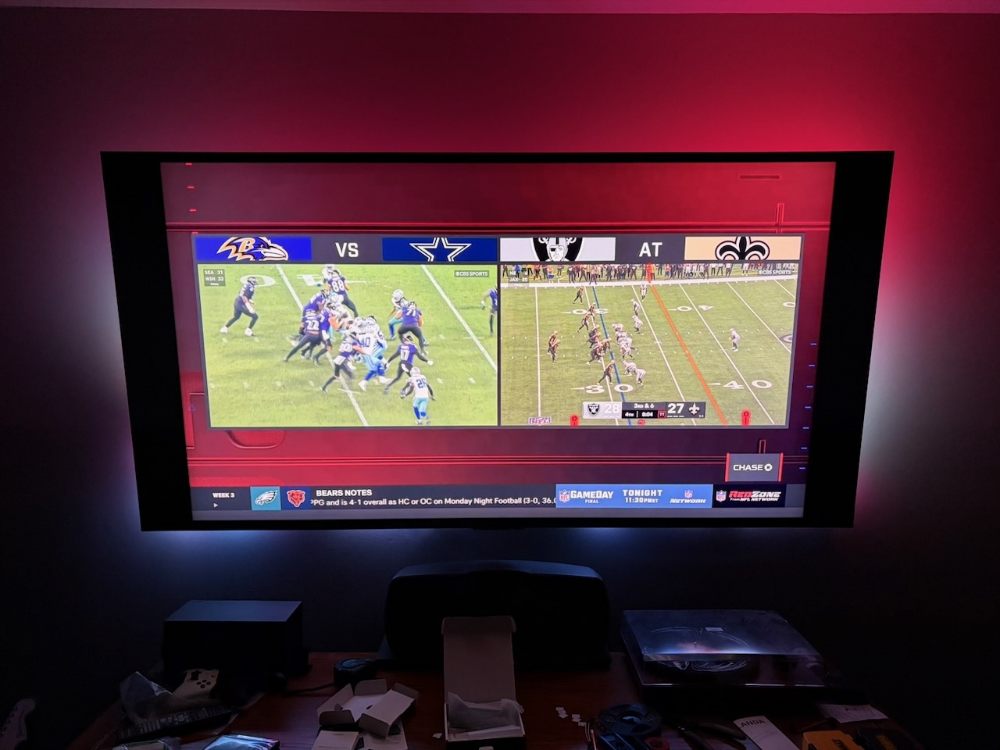

I’ve purchased all the parts, inlcuding a spice rack at IKEA to store all this hardware on behind the TV. I’ve watched a bunch of videos and done a ton of research on how to wire the LEDs to the power supply and how to solder and mistakes to avoid. Now it's time to put it all together.

I needed my wife’s help as hanging the LEDs on the back of the TV was a two person job. I needed to roughly place the LEDs around the TV so I could measure how long the power and ground cables need to be from the LEDs to the power supply.

With that complete, it was time to solder. I gave a project update on the [latest episode of The Bootloader](https://www.thebootloader.net/episodes/2026/ep037/), and Tod mentioned that soldering LEDs is advanced work, which is good to know because it took a few times to get the 16 AWG electrical wire and ground to stick to the solder pads, even after tinning the wires and making sure I used enough flux. I am in no way good at soldering.

We then went to install and hang the lights and, of course, one of the solder joints breaks. I fix that and ask my wife for help for a third time, and her being a bit more skinny than I am, clips most of the LEDs in.

After that, I get the other hardware up and running: Get the Raspberry Pi ready, plug the Scorpio microcontroller in to the Pi for power, with the ground and data soldered to the LEDs, and plug in the USB capture card to the Pi.

Upon booting the Raspberry Pi, you access the HyperHDR configuration via a web page hosted on the Raspberry Pi. I followed the documentation as best as I could and updated the config with where my LEDs starts, the direction they go, and how many on each of the 4 edges of the TV. (I’ll be honest, I guesstimated here).

But nothing happened after entering everything in. I tuned the TV in to a football game, but the colors didn’t light up. One of the neat features of HyperHDR is you can preview the stream of the USB Capture Card. I wasn’t getting a signal, it was just a black screen. Sure enough, after 10 minutes of troubleshooting, I realize the HDMI cable isn’t plugged all the way in to the Ugreen USB capture card. Fixed that and everything started!

It looks like the picture above.  The row of LEDs along the bottom aren’t quite straight, but other than that, the colors work great and I find it immersive.

Was it worth the money? Probably not. Did I learn a lot? Yes. Do I like it? Yes.
