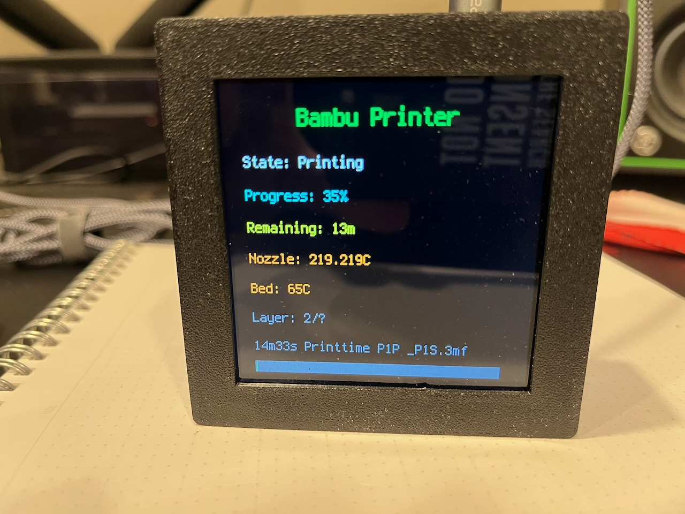

I follow a number of people on GitHub and one of them is my good friend [todbot](https://todbot.com). I noticed in my feed he he had starred an Arduino program called [Bambu Helper](https://github.com/Keralots/BambuHelper) that displays information and statistics from your Bambu Labs printer, such as the percentage progress of the current print, nozzle 
temperature, fan speed, and more.

That got me thinking - if it can be done in Arduino, it can be done in CircuitPython. It's been a couple years since I had a good CircuitPython project, so away I went. I started researching the [Bambu API](https://bambutools.github.io/bambulabs_api/api.html) and more GitHub repositories than I can count, mostly Python projects that connect to a Bambu Printer using MQTT.

I then used [MQTTX](https://mqttx.app) to connect to my printer and test the various MQTT methods. I was able to successfully connect to my P1P printer both through Bambu Cloud and locally over my network.

And then I cheated - I used Claude to bootstrap the project by pointing it at the API Docs and the BambuHelper Arduino app to create a [proof of concept in CircuitPython](https://github.com/prcutler/CircuitBambu).  (I know, I know... the AI skeptic just used AI) It got pretty close - it did get the MQTT command to request a full status update wrong, but that was an easy fix.

I had the proof of concept working on my S3 Qualia board and 4" display:



One thing I learned, though I'm waiting to confirm, is that CircuitPython only uses MQTT 5.0, and not 3.1.1.  Connecting via Bambu Cloud will connect on both MQTT standards, but the local connection only will connect using 3.1.1, which CircuitPython doesn't appear to use that I could figure out. That means you have a few extra hoops to jump through to get a token and user ID, but it wasn't that hard and I've documented the process.

Unfortunately I appear to have fried both my S3 and S2 Reverse TFTs (thanks macOS) which I wanted to prototype with. Using a $50 worth of equipment is a bit much for a project like this. But that got me thinking - what if I could create a library so people could just get the info from the printer and then build their own UI on top of it to match their choice of microcontroller and screen?

So that's what I did next, by creating the [CircuitPython_bambulabs](https://github.com/prcutler/CircuitPython_bambulabs/) library.  This is the first time I've ever created a library and I'm 
following along with both the [Learn Guide](https://learn.adafruit.com/creating-and-sharing-a-circuitpython-library/overview) and the [design reference](https://docs.circuitpython.org/en/stable/docs/design_guide.html). Parts of the Learn Guide are outdate (hello Ruff), 
but overall it hasn't been bad, though I loathe writing reStructured Text and much prefer Markdown. At 
least the cookiecutter setup makes it easy to edit.

Assuming you've got all the settings correct in `settings.toml`, the library handles the MQTT setup and 
querying the printer to get the JSON response and breaking down that response into individual methods.
 
It is also possible to send commands to your printer, for example to set the bed temperature or turn the 
light on or off. I purposefully did not include commands, this library is only for viewing the various 
status messages available from the printer.

I created a simpletest that looks like this:

```
# SPDX-FileCopyrightText: 2017 Scott Shawcroft, written for Adafruit Industries
# SPDX-FileCopyrightText: Copyright (c) 2026 Paul Cutler
#
# SPDX-License-Identifier: MIT

import json
import os

import wifi

import bambulabs as bl

# You will need a settings.toml file with the following to connect via MQTT:
# bambu_broker = os.getenv("BAMBU_BROKER")
# access_token = os.getenv("BAMBU_ACCESS_TOKEN")
# user_id = os.getenv("USER_ID")
# DEVICE_ID = "your_printer_serial_number"

# Set up networking
print("Connecting to AP...")
wifi.radio.connect(os.getenv("CIRCUITPY_WIFI_SSID"), os.getenv("CIRCUITPY_WIFI_PASSWORD"))
print(f"Connected to {os.getenv('CIRCUITPY_WIFI_SSID')}")
print(f"My IP address: {wifi.radio.ipv4_address}")

device_id = os.getenv("DEVICE_ID")

printer = bl.BambuPrinter(bl.mqtt_client, device_id)
printer.connect()

status = printer.pushall()

if status is None:
    print("Timed out waiting for pushall response.")
else:
    # Print out each individual status
    print("--- Printer Status ---")
    print(f"State:             {status.gcode_state}")
    print(f"File:              {status.gcode_file}")
    print(f"Job:               {status.subtask_name}")
    print(f"Progress:          {status.print_percentage}%")
    print(f"Remaining:         {status.remaining_time} min")
    print(f"Layer:             {status.current_layer} / {status.total_layers}")
    print(f"Print speed:       {status.print_speed}")
    print(f"Print error:       {status.print_error_code}")
    print(f"Nozzle temp:       {status.nozzle_temperature} / {status.nozzle_temperature_target} C")
    print(f"Bed temp:          {status.bed_temperature} / {status.bed_temperature_target} C")
    print(f"Chamber temp:      {status.chamber_temperature} C")
    print(f"Part fan:          {status.part_fan_speed}")
    print(f"Aux fan:           {status.aux_fan_speed}")
    print(f"Chamber fan:       {status.chamber_fan_speed}")
    print(f"Nozzle type:       {status.nozzle_type}")
    print(f"Nozzle diameter:   {status.nozzle_diameter} mm")
    print(f"WiFi signal:       {status.wifi_signal}")
    print(f"Light state:       {status.light_state}")
    print(f"Firmware version:  {status.firmware_version}")
    print()
    # Print the entire JSON response
    print("--- Raw JSON ---")
    print(json.dumps(status.raw))
  
  ```
  
The GitHub Actions for the library are currently failing as it doesn't import the `bambulabs` library or the `wifi` module.  I'm not sure why yet and have asked for some help. If you want to test it out, you can [clone the repo](https://github.com/prcutler/CircuitPython_bambulabs/) and copy the `bambulabs.py` file to your `/lib` directory or the root directory of your CircuitPython microcontroller.

When the library is finally published and is available via `circup`, I'll post an update to the blog.  And if you have any feedback, please let me know by dropping me an email or leaving an issue or comment in the repository.
