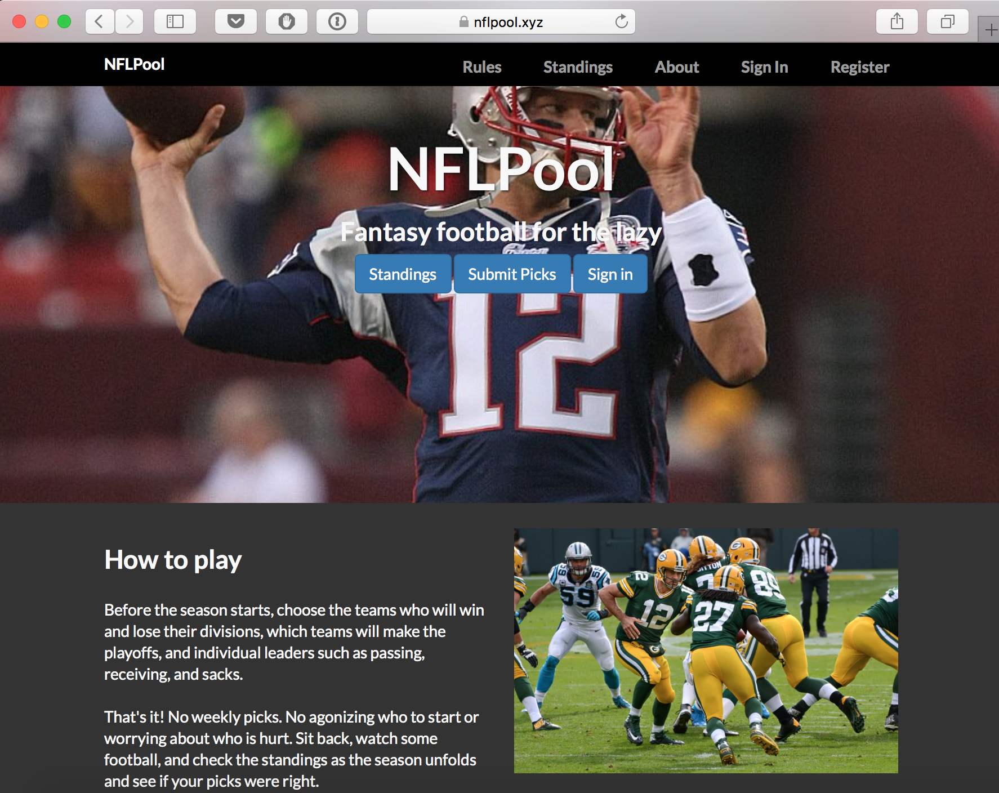

# NFLPool

NFLPool is based on MLBPool, originally created by Jason Theros. MLBPool came to an end in 2011 and in 2013, a
small group of friends resurrected it as MLBPool2. (Original, huh?) Unfortunately, we weren't as smart as Mr. Theros,
who had created a website written in ASP which auto-updated the standings and the code was no longer available.
This meant we had to do it by hand and published the results in a Google Doc on MLBPool2.com.

In 2015, the same group of friends decided to re-create the league, but for football. The major difference between
MLBPool2 and NFLPool is that MLBPool2 allows you to change your picks at mid-season and NFLPool does not.
Like MLBPool2, the first two years of NFLPool featured all of the updates done by hand. In early 2016, looking
for a hobby, I decided to learn Python to automate the scoring process and to keep historical records.  NFLPool is
the first Python (and first Pyramid) app I ever created.  NFLPool ran over the 2017 and 2018 seasons and came to an
end in 2020.  The code is open source, licensed under the MIT / X11 license, and archived on Github.

Learn more:

* [NFLpool.xyz](https://nflpool.xyz)
* [Github (Source Code)](https://github.com/prcutler/nflpool) - Licensed under the MIT license
* [NFLPool Rules](https://nflpool.xyz/home/rules)
* [Site Credits](https://nflpool.xyz/home/credits)
