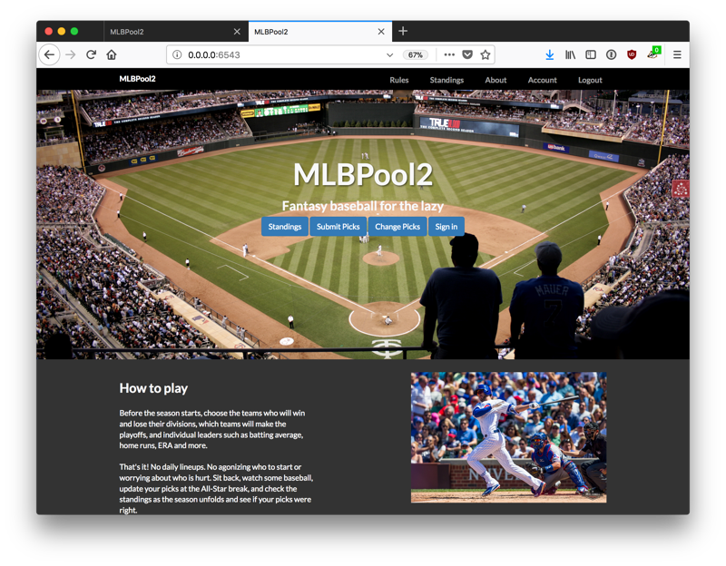

# MLBPool

MLBPool was originally created by Jason Theros as a web application in ASP.net. MLBPool came to an end in 2011 and in
2013, a small group of friends resurrected it as MLBPool2. (Original, huh?) Unfortunately, we weren't as smart
as Mr. Theros, who had created a website written in ASP which auto-updated the standings and the code was no
longer available. This meant we had to do it by hand and published the results in a Google Doc.

In 2015, the same group of friends decided to re-create the league, but for football. Like MLBPool2, the first
two years of NFLPool featured all of the updates done by hand. In early 2016, looking for a hobby, I decided to
learn Python to automate the scoring process and to keep historical records. The NFLPool application
launched in 2017 and MLBPool2 followed a year later. MLBPool2 ran for two years over the 2018 and 2019 seasons before
ending again.  The code is open source (MIT license) and archived on Github.

Learn more:

* [MLBpool2.com](https://mlbpool2.com)
* [Github (Source Code)](https://github.com/prcutler/mlbpool2) - Licensed under the MIT license
* [MLBPool Rules](https://mlbpool2.com/home/rules)
* [MLBPool User and Developer Documentation](http://mlbpool2.readthedocs.io/en/latest/) (Including how to play)
* [Site Credits](https://mlbpool2.com/home/credits)
