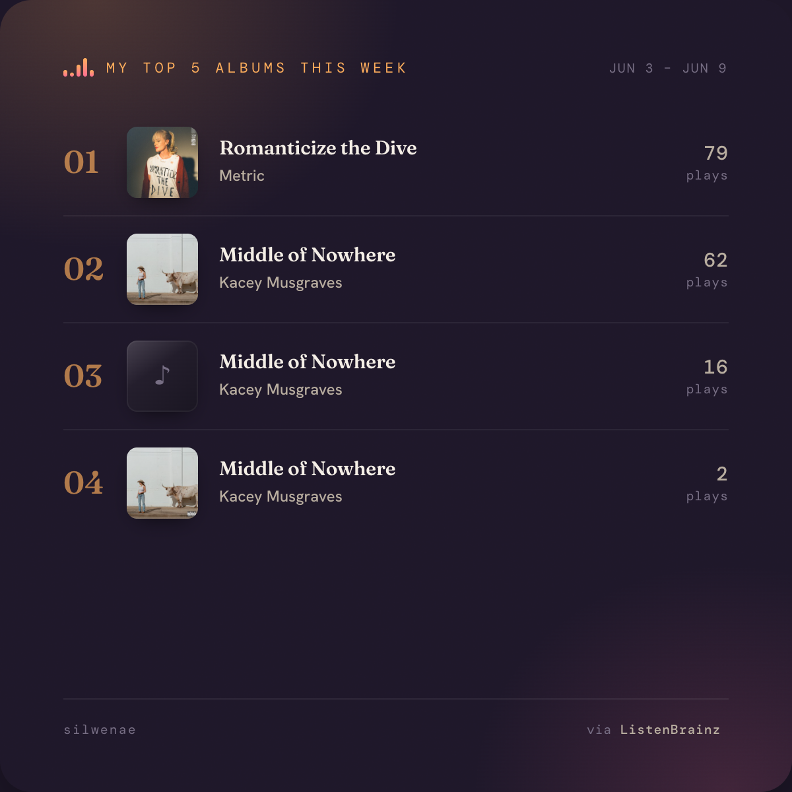

# ListenBrainz

## Overview

There are three different ListenBrainz projects created in June, 2026:
* [ListenBrainz-widget](https://prcutler.github.io/listenbrainz-widget/index.html)
* [ListenBrainz-autoposter](https://github.com/prcutler/listenbrainz-autoposter)
* [ListenBrainz-to-bluesky](https://github.com/prcutler/listenbrainz-to-bluesky)

- Source code: [https://github.com/prcutler/circuitpython-bambulabs](https://github.com/prcutler/circuitpython-bambulabs)
- ReadtheDocs: [https://circuitpython-bambulabs.readthedocs.io/](https://circuitpython-bambulabs.readthedocs.io/)

### ListenBrainz-widget

ListenBrainz-widget provides two self-contained, no-build HTML widgets for displaying ListenBrainz listening data.

1. Now Playing widget (listenbrainz-now-playing.html)

* Auto-refreshing card meant to be embedded as an iframe
* Polls the ListenBrainz API every 20 seconds
* Shows "Now Playing" with album art and an animated equalizer when active, falling back to "Last Played" with a timestamp otherwise
* Pauses polling when the tab/iframe isn't visible
* Clicking opens the user's ListenBrainz profile
* Username can be hardcoded via a DEFAULT_USERNAME constant or passed as a ?user= URL param (URL param wins if both set)
* Background colors are tweakable via two CSS variables (--bg-0/--bg-1) to match a host site's theme

2. Top 5 Albums widget (top5.html)

* Generates a shareable 1200×1200 PNG of the user's top 5 most-played albums with cover art, rendered at 2x resolution for crisp social posts
* Dropdown to pick a time range: This week, Last week, This month, This year, All time — these map to ListenBrainz's fixed calendar ranges (not rolling windows), and the README has a detailed caveat about how the stats API lags and what each range actually returns
* Same username configuration approach as the Now Playing widget

Source: [ListenBrainz-widget](https://github.com/prcutler/listenbrainz-widget)

### ListenBrainz-autoposter

A fully automated, serverless job that posts your top 5 ListenBrainz albums from the previous week to Bluesky and/ or Mastodon, running entirely on GitHub Actions (no Cloudflare Worker or server needed). It's a spiritual successor to [willmanduffy's scrobble-blue](https://github.com/willmanduffy/scrobble-blue), rebuilt around GitHub Actions + ListenBrainz.

How it works:

* A scheduled workflow fires every Tuesday at 15:07 UTC
* Pulls last week's listening stats from ListenBrainz's public statistics API (range=week)
* Uses Playwright/headless Chromium to render a 1200×1200 image card of the top 5 albums with cover art
* Posts the image with a short caption to whichever platforms are configured; falls back to text-only if the image render fails
* Runs on Tuesday specifically because ListenBrainz's "week" stat is the prior completed Monday–Sunday and lags by a day or two — Tuesday ensures the numbers are settled

Source: [ListenBrainz-autoposter](https://github.com/prcutler/listenbrainz-autoposter)

### ListenBrainz-to-Bluesky

A Python program that automatically syncs your Bluesky bio with what you're currently listening to on ListenBrainz, adding a line like "🎵 Listening to: Tremolo by Metric" and swapping it out as your tracks change, all without touching the rest of your bio text. Runs self-hosted on your own server using `cron`.

How it works:

* `update_bio.py` runs every 5 minutes via cron
* Fetches your latest listen from the ListenBrainz public API (no auth needed for reads)
* Logs into Bluesky via the AT Protocol XRPC API, pulls your current profile record
* Strips any previous "🎵 Listening to:" line and appends the new one
* Skips the write entirely if the track hasn't changed since last run (avoids needless API calls)
* Truncates if needed to respect Bluesky's 256-character bio limit

Source: [ListenBrainz-to-bluesky](https://github.com/prcutler/listenbrainz-to-bluesky)
