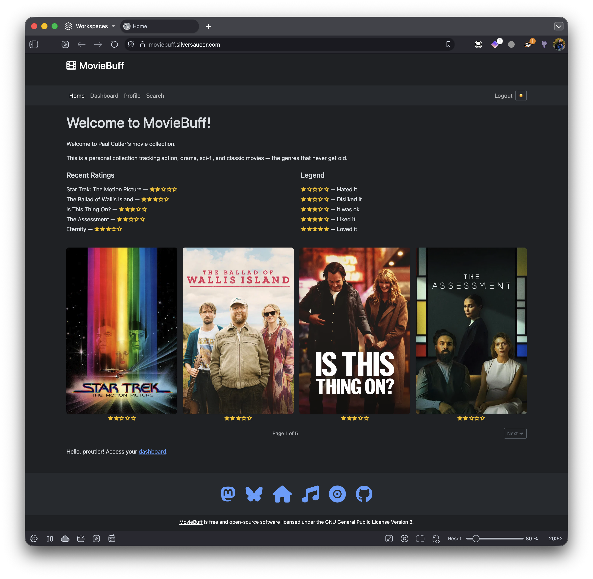

# Moviebuff

## Project Overview

Moviebuff is an application orginally written by [retiolus](https://codeberg.org/retiolus/moviebuff) and licensed under the GPL v3. Moviebuff is a Django application to track and rate the movies you watch.

After forking Moviebuff, I used Claude to make some significant changes to the app:

- Added dark mode and made it the default with a toggle to change light or dark mode on the home page
- Added working Federation based on the buiding blocks present in the app
- Changed Federation to only post when a movie is rated. Also added a Share to Fediverse button using HTMX that appears when a movie is added to the Watched Movies list
- Add an environment variable and code to enable or disable registration (to avoid spammers)
- Disabled the registration pages if the user is unauthenticated and registration is disabled
- Updated the home page to show a legend, the five most recent movies rated, movie posters for the four most recent movies rated, and HTMX to page through the rated movies
- In the Dashboard, added HTMX to page through all the Watched Movies
- In each movie card, added the star ratings for the movie
- Updated the datetime fields to be MON/DAY/YEAR and added commas to the movie's budget
- Added a Font Awesome film icon in the upper left and made it and Moviebuff clickable to return to the home page
- Added a custom footer that matches [silversaucer.com](https://silversaucer.com)
- Added a CONTRIBUTING.md and CODE_OF_CONDUCT.md
- Added installation instructions in the README

## Demo

See it in action at [https://moviebuff.silversaucer.com](https://moviebuff.silversaucer.com)

